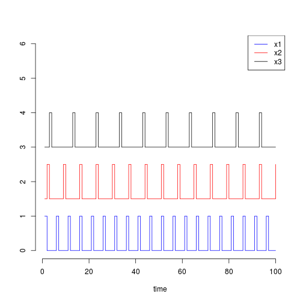
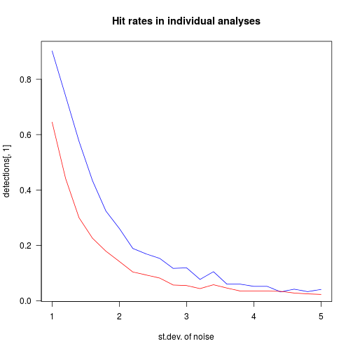
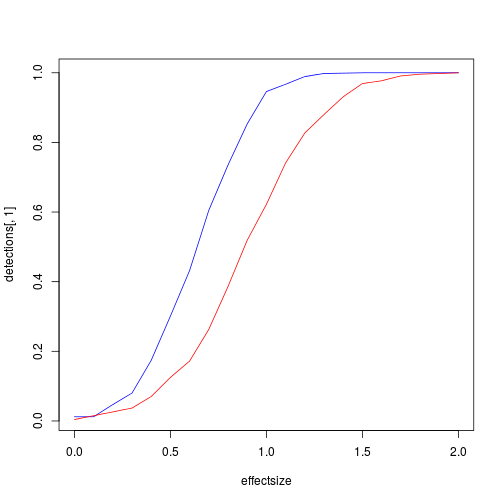

Estimating the effect of number of measurements on detection in a multiple regression framework
===============================================================================================


```r
proplessthan01 <- function(x) { mean(x<.01) }
```


Single-subject simulations

We model 3 types of events, that occur respectively, 20, 15 and 10 times, in a 100 time-series.  


```r
x1 <- numeric(100)
x2 <- numeric(100)
x3 <- numeric(100)

x1[seq(1,100,by=5)] <- 1
x2[seq(2,100,by=7)] <- 1
x3[seq(3,100,by=10)] <- 1

plot(x1, col='blue', type='s', ylim=c(0,6), axes=FALSE, bty='l', xlab='time', ylab='')
axis(1)
axis(2)
lines(1.5+ x2, col='red', type='s')
lines(3+ x3, col='black', type='s')
legend('topright',c('x1','x2','x3'), lty=1, col=c('blue','red','black'))
```

 

```r
sum(x1)
```

```
## [1] 20
```

```r
sum(x2)
```

```
## [1] 15
```

```r
sum(x3)
```

```
## [1] 10
```

```r
nsim = 1000

detections <- data.frame(x1=numeric(0), x2=numeric(0), x3=numeric(0))

for (sd in seq(1,5, by=.2))
  {
pvals <- data.frame()
for (i in 1:nsim)
{
y <- x1 + x2 +x3 + rnorm(100, sd=sd)  
m1 <- lm(y ~ x1 + x2 + x3)
pv <- summary(m1)$coefficients[2:4,4]
pvals <- rbind(pvals, pv)
}

detections <- rbind(detections, apply(pvals, 2, proplessthan01))
}

detections
```

```
##    X0.902 X0.818 X0.645
## 1   0.902  0.818  0.645
## 2   0.740  0.650  0.442
## 3   0.576  0.505  0.300
## 4   0.434  0.371  0.226
## 5   0.324  0.245  0.179
## 6   0.261  0.216  0.142
## 7   0.189  0.154  0.104
## 8   0.169  0.129  0.093
## 9   0.153  0.100  0.082
## 10  0.117  0.089  0.057
## 11  0.119  0.088  0.055
## 12  0.077  0.062  0.044
## 13  0.105  0.057  0.058
## 14  0.060  0.052  0.046
## 15  0.060  0.048  0.035
## 16  0.052  0.047  0.035
## 17  0.052  0.037  0.035
## 18  0.032  0.036  0.034
## 19  0.042  0.029  0.028
## 20  0.033  0.041  0.025
## 21  0.041  0.030  0.023
```

```r
plot(seq(1,5, by=.2), detections[,1], type='l', col='blue', main='Hit rates in individual analyses', xlab='st.dev. of noise', las=1)
lines(seq(1,5, by=.2), detections[,3], type='l', col='red')
```

 

Group-level


```r
detections <- data.frame(x1=numeric(0), x2=numeric(0))


for (effsize in seq(0, 2, by=0.1))
{
  pvals = data.frame(x1=numeric(0), x2=numeric(0))
  for (i in 1:nsim)
    { 
     a <- rnorm(20, mean=effsize,sd=1)
     b <- rnorm(20, mean=effsize, sd=sqrt(2))
     pvals <- rbind(pvals, data.frame(x1=t.test(a)$p.value, x2=t.test(b)$p.value))
    }
  detections <- rbind(detections, apply(pvals, 2, proplessthan01))
}

effectsize <- seq(0, 2, by=0.1) 
plot(effectsize, detections[,1], col='blue', type='l')
lines(effectsize, detections[,2], col='red')
```

 


