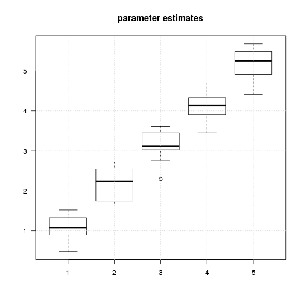

Tests of the efficiency of various fMRI designs
===============================================

Time-stamp: <2013-01-08 17:06 christophe@pallier.org>

Note: This document is generated from the source file [simul6.Rmd](simul6.Rmd), a Rmarkdown document that can be processed with knitr and edited with rstudio.

We present some simulations comparing the power of designs with fixed ISI to designs with varying ISI. We are interested in how precise are the estimates of the parameters associated to each condition.


```
## Loading required package: MASS
```


Parameters for the simulations
------------------------------


```r

ncond <- 5  # number of conditions
trialpercond <- 20
stimduration <- 6  # in sec
SOA <- 8  # in sec
(totalduration <- (ncond * trialpercond * SOA) + SOA)
```

```
## [1] 808
```


Contrasts of interest


```r
(listcon <- list(linear = (1:ncond) - mean(1:ncond), firstbeta = c(1, rep(0, 
    ncond - 1))))
```

```
## $linear
## [1] -2 -1  0  1  2
## 
## $firstbeta
## [1] 1 0 0 0 0
## 
```

The number of simulations for each class of designs:


```r
nsim = 10
```


The simulations will use normal noise


```r
normalnoise <- function(npoints) {
    5 * rnorm(npoints)
}
```


Fixed SOA, no silent trial
--------------------------

Let us generate a paradigm with a fixed SOA...


```r
timing <- generate_paradigm_fixed_SOA(ncond, trialpercond, stimduration, SOA, 
    totalduration)
plot_paradigm(timing)
```

 


... and build its associated design matrix


```r
X <- create_design_matrix(timing, totalduration)
plot_design_matrix(X)
```

 


Now,  for many such designs, we simulate a voxel where the signal increases in a linear fashion with 'condition' (amplitudes=1:5).


```r
o <- simulations(nsim, beta = 1:ncond, listofcontrasts = listcon, normalnoise, 
    generate_paradigm_fixed_SOA, ncond, trialpercond, stimduration, SOA, totalduration)
```


```r
report <- function(outputsim) {
    par(las = 1)
    boxplot(outputsim$estimates, main = "parameter estimates")
    grid()
    boxplot(outputsim$estimatese, main = "standard errors")
    grid()
    for (col in 1:ncol(outputsim$efficiencies)) boxplot(outputsim$efficiencies[, 
        col], main = paste("Efficiency", names(listcon)[col]), horizontal = TRUE)
    grid()
}
```


```r
report(o)
```

    


Designs with jitter between trials
----------------------------------

Now, we jitter the SOA between trials and run a similar simulation.


```r
timing <- generate_paradigm_varying_SOA(ncond, trialpercond, stimduration, SOA, 
    jitter = 4, totalduration)
plot_paradigm(timing)
```

 

```r
X <- create_design_matrix(timing, totalduration)
plot_design_matrix(X)
```

 


histogram of SOAs:


```r
hist(diff(timing$onsets))
```

 


```r
o2 <- simulations(nsim, beta = 1:ncond, listofcontrasts = listcon, normalnoise, 
    generate_paradigm_varying_SOA, ncond, trialpercond, stimduration, 4, SOA, 
    totalduration)
```


```r
report(o2)
```

    


Design with fixed SOA and 'explicit' NULL events
-------------------------------------------------


```r

timing <- generate_paradigm_fixed_SOA_adding_silences(ncond, trialpercond, stimduration, 
    SOA, totalduration)
plot_paradigm(timing)
```

 

```r
totalduration <- max(timing$onsets) + SOA
X <- create_design_matrix(timing, totalduration)
plot_design_matrix(X)
```

 

```r

o3 <- simulations(nsim, beta = 1:ncond, listofcontrasts = listcon, normalnoise, 
    generate_paradigm_fixed_SOA_adding_silences, ncond, trialpercond, stimduration, 
    SOA, totalduration)

report(o3)
```

    


Designs with varying ISI (a la optseq)
--------------------------------------

Here, the same total amount of silence is inserted as NULL events of varying length between the 'real' trials, introducing jitter.


```r
timing <- generate_paradigm_varying_SOA_null_events(ncond, trialpercond, stimduration, 
    SOA, totalduration)
plot_paradigm(timing)
```

 

```r
totalduration <- max(timing$onsets) + SOA
X <- create_design_matrix(timing, totalduration)
plot_design_matrix(X)
```

 


histogram of SOAs:


```r
hist(diff(timing$onsets))
```

 


```r
o4 <- simulations(nsim, beta = 1:ncond, listofcontrasts = listcon, normalnoise, 
    generate_paradigm_varying_SOA_null_events, ncond, trialpercond, stimduration, 
    SOA, totalduration)

report(o4)
```

    


Importing designs
-----------------

### Fixed SOA with empty trials


```r
timing <- read.table("fMRI_Order_10.csv", sep = ",", col.names = c("onsets", 
    "conditions", "durations"))
timing <- subset(timing, conditions <= 8)
plot_paradigm(timing)
```

 

```r
(totalduration <- max(timing$onsets) + 10)
```

```
## [1] 770
```

```r
table(timing$conditions)
```

```
## 
## 1 2 3 4 5 6 7 8 
## 8 8 8 8 8 8 8 8 
```

```r

X <- create_design_matrix(timing, totalduration)
plot_design_matrix(X)
```

 


```r
betas <- c(1:4, 1:4, 0, 0)
singlesimul(X, betas, list(lin = betas - mean(betas)), normalnoise)
```

```
## Error: non-conformable arguments
```


```r
for (csvfile in Sys.glob("fMRI_Order*.csv")) {
    timing <- read.table(csvfile, sep = ",", col.names = c("onsets", "conditions", 
        "durations"))
    print("Totalduration")
    print(totalduration <- max(timing$onsets) + 10)
    print(table(timing$conditions))
    timing <- subset(timing, conditions <= 8)
    X <- create_design_matrix(timing, totalduration)
    betas <- c(1:4, 1:4)
    print(singlesimul(X, betas, list(lin = betas - mean(betas)), normalnoise))
}
```

```
## [1] "Totalduration"
## [1] 770
## 
##  1  2  3  4  5  6  7  8  9 10 11 12 
##  8  8  8  8  8  8  8  8  8  8  8  8 
## $estimates
##   XX1   XX2   XX3   XX4   XX5   XX6   XX7   XX8 
## 1.079 1.928 3.171 3.845 1.550 2.353 3.046 3.921 
## 
## $estimatese
##    XX1    XX2    XX3    XX4    XX5    XX6    XX7    XX8 
## 0.2751 0.2751 0.2767 0.2758 0.2750 0.2789 0.2764 0.2767 
## 
## $efficiencies
## [1] 40.36
## 
## [1] "Totalduration"
## [1] 770
## 
##  1  2  3  4  5  6  7  8  9 10 11 12 
##  8  8  8  8  8  8  8  8  8  8  8  8 
## $estimates
##   XX1   XX2   XX3   XX4   XX5   XX6   XX7   XX8 
## 1.232 1.801 3.045 3.536 0.746 2.160 3.138 3.782 
## 
## $estimatese
##    XX1    XX2    XX3    XX4    XX5    XX6    XX7    XX8 
## 0.2822 0.2829 0.2807 0.2788 0.2776 0.2799 0.2796 0.2789 
## 
## $efficiencies
## [1] 39.88
## 
## [1] "Totalduration"
## [1] 770
## 
##  1  2  3  4  5  6  7  8  9 10 11 12 
##  8  8  8  8  8  8  8  8  8  8  8  8 
## $estimates
##    XX1    XX2    XX3    XX4    XX5    XX6    XX7    XX8 
## 1.3527 1.9456 2.8183 4.0430 0.7796 2.2711 3.5872 3.8429 
## 
## $estimatese
##    XX1    XX2    XX3    XX4    XX5    XX6    XX7    XX8 
## 0.2852 0.2757 0.2812 0.2761 0.2767 0.2765 0.2787 0.2757 
## 
## $efficiencies
## [1] 40.01
## 
## [1] "Totalduration"
## [1] 770
## 
##  1  2  3  4  5  6  7  8  9 10 11 12 
##  8  8  8  8  8  8  8  8  8  8  8  8 
## $estimates
##   XX1   XX2   XX3   XX4   XX5   XX6   XX7   XX8 
## 1.048 2.296 2.942 4.143 1.247 1.921 3.395 4.433 
## 
## $estimatese
##    XX1    XX2    XX3    XX4    XX5    XX6    XX7    XX8 
## 0.2819 0.2805 0.2794 0.2819 0.2813 0.2820 0.2769 0.2790 
## 
## $efficiencies
## [1] 39.72
## 
## [1] "Totalduration"
## [1] 770
## 
##  1  2  3  4  5  6  7  8  9 10 11 12 
##  8  8  8  8  8  8  8  8  8  8  8  8 
## $estimates
##    XX1    XX2    XX3    XX4    XX5    XX6    XX7    XX8 
## 0.7706 2.1339 3.4137 4.3082 1.3014 1.9103 3.2223 4.0588 
## 
## $estimatese
##    XX1    XX2    XX3    XX4    XX5    XX6    XX7    XX8 
## 0.2758 0.2814 0.2796 0.2768 0.2805 0.2787 0.2768 0.2767 
## 
## $efficiencies
## [1] 40.17
## 
## [1] "Totalduration"
## [1] 770
## 
##  1  2  3  4  5  6  7  8  9 10 11 12 
##  8  8  8  8  8  8  8  8  8  8  8  8 
## $estimates
##   XX1   XX2   XX3   XX4   XX5   XX6   XX7   XX8 
## 1.179 2.445 3.111 4.443 0.972 2.031 2.910 4.142 
## 
## $estimatese
##    XX1    XX2    XX3    XX4    XX5    XX6    XX7    XX8 
## 0.2809 0.2824 0.2823 0.2783 0.2795 0.2853 0.2805 0.2823 
## 
## $efficiencies
## [1] 39.55
## 
## [1] "Totalduration"
## [1] 770
## 
##  1  2  3  4  5  6  7  8  9 10 11 12 
##  8  8  8  8  8  8  8  8  8  8  8  8 
## $estimates
##   XX1   XX2   XX3   XX4   XX5   XX6   XX7   XX8 
## 1.011 1.810 3.005 4.127 1.209 1.854 3.087 4.065 
## 
## $estimatese
##    XX1    XX2    XX3    XX4    XX5    XX6    XX7    XX8 
## 0.2779 0.2752 0.2776 0.2768 0.2773 0.2778 0.2781 0.2757 
## 
## $efficiencies
## [1] 39.77
## 
## [1] "Totalduration"
## [1] 770
## 
##  1  2  3  4  5  6  7  8  9 10 11 12 
##  8  8  8  8  8  8  8  8  8  8  8  8 
## $estimates
##    XX1    XX2    XX3    XX4    XX5    XX6    XX7    XX8 
## 1.1987 2.5112 2.7113 3.6970 0.7845 2.2014 3.0236 4.0885 
## 
## $estimatese
##    XX1    XX2    XX3    XX4    XX5    XX6    XX7    XX8 
## 0.2799 0.2816 0.2790 0.2851 0.2882 0.2812 0.2861 0.2836 
## 
## $efficiencies
## [1] 38.74
## 
## [1] "Totalduration"
## [1] 770
## 
##  1  2  3  4  5  6  7  8  9 10 11 12 
##  8  8  8  8  8  8  8  8  8  8  8  8 
## $estimates
##    XX1    XX2    XX3    XX4    XX5    XX6    XX7    XX8 
## 1.1391 1.9060 3.7029 4.0977 0.9922 2.0392 3.3451 3.8746 
## 
## $estimatese
##    XX1    XX2    XX3    XX4    XX5    XX6    XX7    XX8 
## 0.2762 0.2780 0.2740 0.2771 0.2788 0.2779 0.2764 0.2808 
## 
## $efficiencies
## [1] 39.61
## 
## [1] "Totalduration"
## [1] 770
## 
##  1  2  3  4  5  6  7  8  9 10 11 12 
##  8  8  8  8  8  8  8  8  8  8  8  8 
## $estimates
##    XX1    XX2    XX3    XX4    XX5    XX6    XX7    XX8 
## 0.4678 1.4339 2.2035 3.4842 0.5368 1.6877 3.0275 3.9580 
## 
## $estimatese
##    XX1    XX2    XX3    XX4    XX5    XX6    XX7    XX8 
## 0.2821 0.2813 0.2803 0.2849 0.2791 0.2812 0.2770 0.2772 
## 
## $efficiencies
## [1] 38.32
## 
```

  
### sequences created by optseq  


```r
timing <- read.table("optseq/simcomp-001.par", col.names = c("onsets", "conditions", 
    "durations", "weight", "condn"))
```

```
## Warning: cannot open file 'optseq/simcomp-001.par': No such file or
## directory
```

```
## Error: cannot open the connection
```

```r
totalduration <- max(timing$onsets) + 10
print("Totalduration")
```

```
## [1] "Totalduration"
```

```r
print(totalduration <- max(timing$onsets) + 10)
```

```
## [1] 770
```

```r
timing <- subset(timing, conditions != 0)
print(table(timing$conditions))
```

```
## 
## 1 2 3 4 5 6 7 8 
## 8 8 8 8 8 8 8 8 
```

```r
hist(diff(timing$onsets))
```

 

```r
plot_paradigm(timing)
```

 

```r

X <- create_design_matrix(timing, totalduration)
plot_design_matrix(X)
```

 


```r
for (csvfile in Sys.glob("optseq/simcomp*.par")) {
    timing <- read.table(csvfile, col.names = c("onsets", "conditions", "durations", 
        "weight", "condn"))
    totalduration <- max(timing$onsets) + 10
    print("Totalduration")
    print(totalduration <- max(timing$onsets) + 10)
    timing <- subset(timing, conditions != 0)
    print(table(timing$conditions))
    hist(diff(timing$onsets))
    X <- create_design_matrix(timing, totalduration)
    betas <- c(1:4, 1:4)
    print(singlesimul(X, betas, list(lin = betas - mean(betas)), normalnoise))
}
```

  

