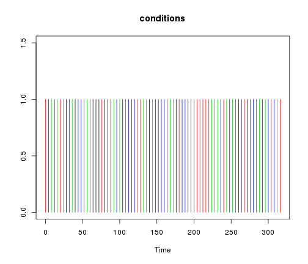
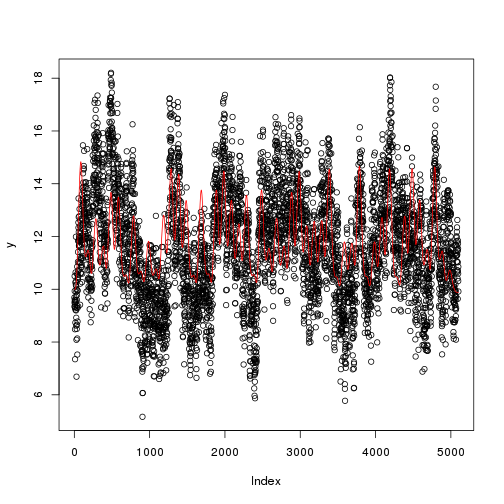
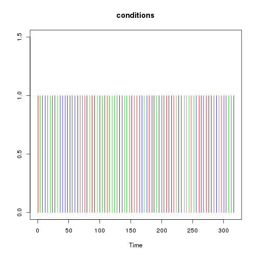
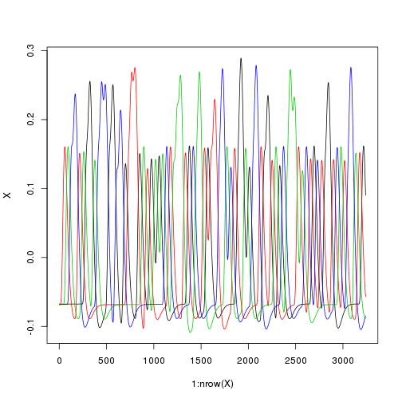

Tests of the efficiency of various fMRI designs
===============================================

Time-stamp: <2013-01-04 10:22:32 pallier>


```
## Loading required package: signal
```

```
## Loading required package: MASS
```

```
## Attaching package: 'signal'
```

```
## The following object(s) are masked from 'package:stats':
## 
## filter, poly
```


First, we generate a paradigm with a fixed SOA.


```r
ncond <- 5
trialpercond <- 10
ntrials <- ncond * trialpercond
conditions <- sample(rep(1:ncond, trialpercond))

SOA <- 10  # in seconds
onsets <- (1:ntrials - 1) * SOA

stimduration <- 6  # in seconds
durations <- rep(stimduration, ntrials)
totalduration <- max(onsets) + 20

plot(onsets, rep(1, ntrials), col = conditions, type = "h", ylim = c(0, 1.5), 
    ylab = "")
```

 

```r
timing <- data.frame(onsets, conditions, durations)
# write.csv(timing, 'timing.csv')
head(timing)
```

```
##   onsets conditions durations
## 1      0          3         6
## 2     10          3         6
## 3     20          4         6
## 4     30          5         6
## 5     40          1         6
## 6     50          4         6
```


Reading timing information from the csv file, we build and plot the design matrix


```r
# timing <- read.csv('timing.csv')
condnames <- sort(unique(timing$conditions))
ncond <- length(condnames)

regressor <- vector("list", ncond)
for (cond in 1:ncond) {
    select <- timing$conditions == condnames[cond]
    print(cond)
    print(timing$onsets[select])
    regressor[[cond]] <- hrf(list(onsets = timing$onsets[select], durations = timing$durations[select]), 
        totalduration)
}
```

```
## [1] 1
##  [1]  40 110 120 140 170 270 290 300 420 440
## [1] 2
##  [1]  70  90 130 180 220 240 310 330 390 490
## [1] 3
##  [1]   0  10  60 210 260 280 320 360 370 480
## [1] 4
##  [1]  20  50 100 150 190 200 350 400 460 470
## [1] 5
##  [1]  30  80 160 230 250 340 380 410 430 450
```

```r

names(regressor) <- condnames
X <- as.matrix(as.data.frame(regressor))
npoints <- nrow(X)
matplot(1:nrow(X), X, type = "l", col = 1:ncond)
```

 


Simulations and Estimation by an hrf model. 
------------------------------------------

We simulate a voxel where the signal increase in a linear fashion with 'cond' (1:5)


```r
betas <- 1:ncond
y0 <- 10 + X %*% betas
nsim <- 100
estimates <- matrix(nrow = nsim, ncol = ncond)
for (sim in 1:nsim) {
    fmri.noise <- pink.noise(npoints)
    y <- y0 + 20 * fmri.noise
    estimates[sim, ] <- coef(lm(y ~ X))[-1]
}
plot(y, col = "black")
lines(y0, col = "red")
```

 

```r
es <- data.frame(estimates = apply(estimates, 2, mean), sd = apply(estimates, 
    2, sd))
es
```

```
##   estimates     sd
## 1    0.9672 0.5985
## 2    1.9516 0.5694
## 3    2.9586 0.5038
## 4    3.9660 0.5488
## 5    5.0783 0.5244
```

```r
plot(1:nrow(es), es[, 1], pch = 16, col = "black", ylim = c(0, 6))
segments(1:nrow(es), es[, 1] - es[, 2], 1:nrow(es), es[, 1] + es[, 2])
```

 


New design, with jitter between trials:
--------------------------------------


```r
SOA <- 10  # in seconds
onsets <- (1:ntrials - 1) * SOA + runif(ntrials, min = -2, max = 2)

stimduration <- 6  # in seconds
durations <- rep(stimduration, ntrials)
totalduration <- max(onsets) + 20

plot(onsets, rep(1, ntrials), col = conditions, type = "h", ylim = c(0, 1.5), 
    ylab = "")
```

 

```r
hist(diff(onsets))
```

 

```r
timing <- data.frame(onsets, conditions, durations)
head(timing)
```

```
##   onsets conditions durations
## 1  1.495          3         6
## 2 11.832          3         6
## 3 20.241          4         6
## 4 31.476          5         6
## 5 38.479          1         6
## 6 50.588          4         6
```


```r
# timing <- read.csv('timing.csv')
condnames <- sort(unique(timing$conditions))
ncond <- length(condnames)

regressor <- vector("list", ncond)
for (cond in 1:ncond) {
    select <- timing$conditions == condnames[cond]
    print(cond)
    print(timing$onsets[select])
    regressor[[cond]] <- hrf(list(onsets = timing$onsets[select], durations = timing$durations[select]), 
        totalduration)
}
```

```
## [1] 1
##  [1]  38.48 110.32 121.99 141.43 170.32 268.04 291.47 300.70 419.15 439.63
## [1] 2
##  [1]  70.96  91.57 128.98 180.30 221.12 238.12 311.96 331.69 390.30 490.68
## [1] 3
##  [1]   1.495  11.832  60.174 211.735 259.643 279.570 319.030 361.342
##  [9] 371.507 480.200
## [1] 4
##  [1]  20.24  50.59 101.11 148.38 188.59 201.84 351.02 399.01 459.11 468.46
## [1] 5
##  [1]  31.48  78.01 161.55 228.60 248.90 341.09 378.15 408.73 428.01 451.49
```

```r

names(regressor) <- condnames
X <- as.matrix(as.data.frame(regressor))
npoints <- nrow(X)
matplot(1:nrow(X), X, type = "l", col = 1:ncond)
```

 


```r
betas <- 1:ncond
y0 <- 10 + X %*% betas
nsim <- 100
estimates <- matrix(nrow = nsim, ncol = ncond)
for (sim in 1:nsim) {
    fmri.noise <- pink.noise(npoints)
    y <- y0 + 20 * fmri.noise
    estimates[sim, ] <- coef(lm(y ~ X))[-1]
}
plot(y, col = "black")
lines(y0, col = "red")
```

 

```r
es <- data.frame(estimates = apply(estimates, 2, mean), sd = apply(estimates, 
    2, sd))
es
```

```
##   estimates     sd
## 1    0.9771 0.4877
## 2    2.0648 0.4611
## 3    2.9483 0.5324
## 4    4.0084 0.4564
## 5    5.0256 0.5259
```

```r
plot(1:nrow(es), es[, 1], pch = 16, col = "black", ylim = c(0, 6))
segments(1:nrow(es), es[, 1] - es[, 2], 1:nrow(es), es[, 1] + es[, 2])
```

 

