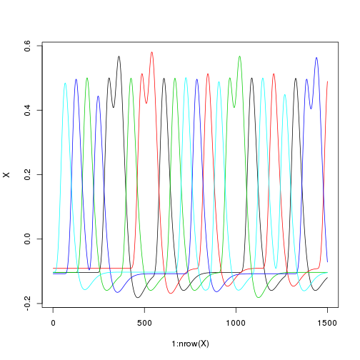
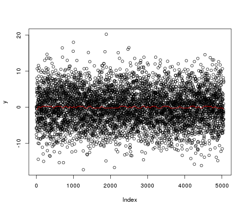
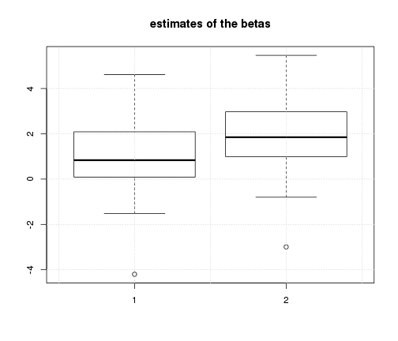
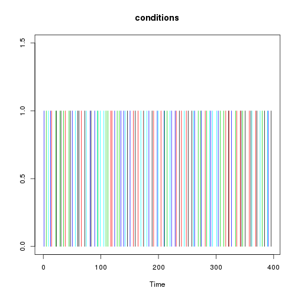
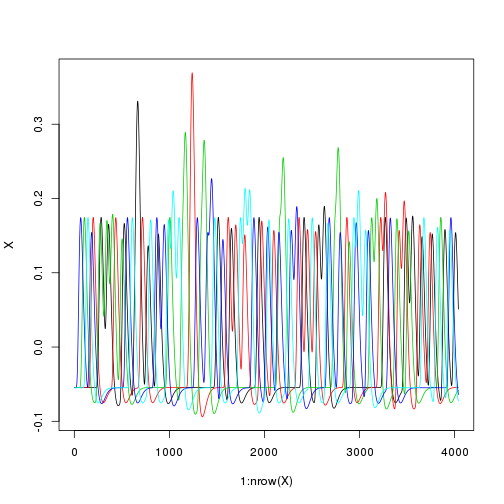
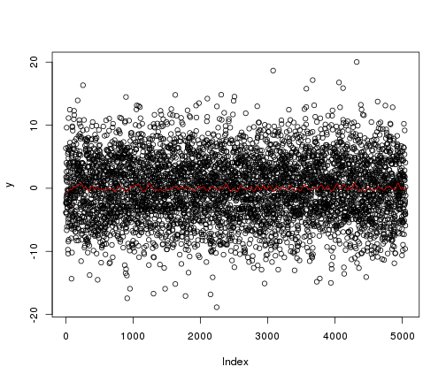

Tests of the efficiency of various fMRI designs
===============================================

Time-stamp: <2013-01-04 10:36:13 pallier>


```
## Loading required package: signal
```

```
## Loading required package: MASS
```

```
## Attaching package: 'signal'
```

```
## The following object(s) are masked from 'package:stats':
## 
## filter, poly
```


We have defined a function that creates paradigms with a fixed SOA.


```r
ncond <- 2
trialpercond <- 50
stimduration <- 2
SOA <- 5
totalduration <- (ncond * trialpercond * SOA) + SOA

timing <- generate_paradigm_fixed_SOA(ncond, trialpercond, stimduration, SOA, 
    totalduration)
head(timing)
```

```
##   onsets conditions durations
## 1      0          1         2
## 2      5          1         2
## 3     10          1         2
## 4     15          1         2
## 5     20          2         2
## 6     25          1         2
```

```r
with(timing, plot(onsets, rep(1, nrow(timing)), col = conditions, type = "h", 
    ylim = c(0, 1.5), ylab = "", xlab = "Time", main = "conditions"))
```

 


Now, we build the design matrix and plot it (remark: the TR is 1sec).


```r
X <- create_design_matrix(timing, totalduration)
npoints <- nrow(X)
matplot(1:nrow(X), X, type = "l", col = 1:ncond)
```

 


Simulations and Estimation by an hrf model. 
------------------------------------------

We simulate a voxel where the signal increases in a linear fashion with 'cond' (amplitudes=1:5)


```r

# generate one noise time series in 1/f, high-pass filtered fmri.noise <-
# pink.noise(npoints) K <- make.hpfilter(npoints,1,60) s <-
# apply.hpfilter(fmri.noise,K)

noise <- 10 * scale(rnorm(npoints))

nsim <- 100  # number of simulations
betas <- 1:ncond  # theoretical amplitudes (per condition)
con <- betas - mean(betas)  # contrast of interest
estimates <- matrix(nrow = nsim, ncol = ncond)
conestimates <- numeric(nsim)
eff <- numeric(nsim)

for (sim in 1:nsim) {
    timing <- generate_paradigm_fixed_SOA(ncond, trialpercond, stimduration, 
        SOA, totalduration)
    X <- create_design_matrix(timing, totalduration)
    eff[sim] <- efficiency(con, X)
    
    y0 <- X %*% betas
    # noise <- 10*scale(rnorm(npoints))
    y <- y0 + noise
    estimates[sim, ] <- coef(lm(y ~ X))[-1]
    conestimates[sim] <- con %*% estimates[sim, ]
}

# plot the signal from the last stimulation (theoretical signal+noise)
plot(y, col = "black")
lines(y0, col = "red")
```

 

```r

# distributions of estimates of individual betas
boxplot(estimates, main = "estimates of the betas")
grid()
```

 

```r

# distribution of estimate of the contrasts
boxplot(conestimates, main = "estimates of the contrast")
```

 

```r


# average of standards errors:
mean(apply(estimates, 2, sd))
```

```
## [1] 0.3746
```

```r
# es <-
# data.frame(estimates=apply(estimates,2,mean),sd=apply(estimates,2,sd))
# es plot(1:nrow(es), es[,1], pch=16, col='black',ylim=c(0,6))
# segments(1:nrow(es), es[,1]-es[,2], 1:nrow(es), es[,1]+es[,2])

boxplot(eff, main = "efficiencies")
```

 


New design, with jitter between trials:
--------------------------------------

Now, we jitter the SOA between trials and run a similar simulation (with the same noise).


```r
timing <- generate_paradigm_fixed_SOA(ncond, trialpercond, stimduration, SOA, 
    totalduration)
ntrials <- nrow(timing)
jitter <- 4
timing$onsets <- abs(timing$onsets + runif(ntrials, min = -jitter/2, max = jitter/2))

plot(timing$onsets, rep(1, ntrials), col = timing$conditions, type = "h", ylim = c(0, 
    1.5), ylab = "")
```

 

```r
hist(diff(timing$onsets))
```

 

```r
head(timing)
```

```
##   onsets conditions durations
## 1  1.348          1         2
## 2  5.639          2         2
## 3 10.834          2         2
## 4 13.096          1         2
## 5 21.921          2         2
## 6 23.204          1         2
```


```r
X <- create_design_matrix(timing, totalduration)
npoints <- nrow(X)
matplot(1:nrow(X), X, type = "l", col = 1:ncond)
```

 


```r
nsim <- 100  # number of simulations
betas <- 1:ncond  # theoretical amplitudes (per condition)
con <- betas - mean(betas)
estimates <- matrix(nrow = nsim, ncol = ncond)
eff <- numeric(nsim)
for (sim in 1:nsim) {
    timing <- generate_paradigm_fixed_SOA(ncond, trialpercond, stimduration, 
        SOA, totalduration)
    ntrials <- nrow(timing)
    timing$onsets <- abs(timing$onsets + runif(ntrials, min = -jitter/2, max = jitter/2))
    X <- create_design_matrix(timing, totalduration)
    eff[sim] <- efficiency(con, X)
    
    y0 <- 10 + X %*% betas
    y <- y0 + noise
    estimates[sim, ] <- coef(lm(y ~ X))[-1]
}

# plot the signal from the last stimulation (theoretical signal+noise)
plot(y, col = "black")
lines(y0, col = "red")
```

 

```r

# distributions of estimates
boxplot(estimates, main = "estimates")
```

 

```r

# average of standards errors:
mean(apply(estimates, 2, sd))
```

```
## [1] 1.079
```

```r
# es <-
# data.frame(estimates=apply(estimates,2,mean),sd=apply(estimates,2,sd))
# es plot(1:nrow(es), es[,1], pch=16, col='black',ylim=c(0,6))
# segments(1:nrow(es), es[,1]-es[,2], 1:nrow(es), es[,1]+es[,2])
boxplot(eff, main = "Efficiencies")
```

 


