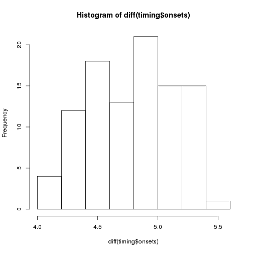
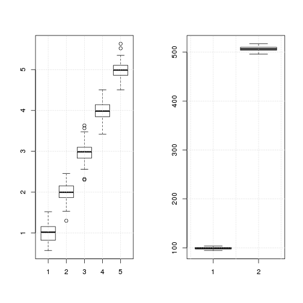

Tests of the efficiency of various fMRI designs
===============================================

Time-stamp: <2013-01-08 17:06 christophe@pallier.org>

We present some simulations comparing the power of designs with fixed ISI to designs with varying ISI. We are interested in the estimates of a linear contrast and of the main effects of each condition versus the baseline. 


```
## Loading required package: MASS
```


We will use the following function (from Dale, 1999).


```r
efficiency <- function(contrast, designMat) # returns the efficiency of a contrast for a given design according to
# Henson (2007), formula 15.4 (from Dale, 1999)
{
    sum(diag(ginv(t(contrast) %*% ginv(crossprod(designMat)) %*% contrast)))
}
```


We can generate paradigms with a fixed SOA...


```r
ncond <- 5
trialpercond <- 20
stimduration <- 6
SOA <- 10
(totalduration <- (ncond * trialpercond * SOA) + SOA)
```

```
## [1] 1010
```

```r

timing <- generate_paradigm_fixed_SOA(ncond, trialpercond, stimduration, SOA, 
    totalduration)

head(timing)
```

```
##   onsets conditions durations
## 1      0          2         6
## 2     10          2         6
## 3     20          2         6
## 4     30          3         6
## 5     40          4         6
## 6     50          4         6
```


...and build the design matrix


```r
X <- create_design_matrix(timing, totalduration)
npoints <- nrow(X)

par(mfrow = c(2, 1))
with(timing, plot(onsets, rep(1, nrow(timing)), col = conditions, type = "h", 
    ylim = c(0, 1.5), ylab = "", xlab = "Time", main = "conditions"))
matplot(1:nrow(X), X, type = "l", col = 1:ncond)
```

 


Remark: the TR is 1sec.

Simulations and Estimation by an hrf model. 
------------------------------------------

We simulate a voxel where the signal increases in a linear fashion with 'condition' (amplitudes=1:5).


```r
nsim <- 100  # number of simulations
betas <- 1:ncond  # theoretical amplitudes (per condition)

con <- betas - mean(betas)  # contrast of interest
con %*% betas  # value of the contrast to be estimated
```

```
##      [,1]
## [1,]   10
```

```r

estimates <- matrix(nrow = nsim, ncol = ncond)
conestimates <- numeric(nsim)
eff <- numeric(nsim)
beta1eff <- numeric(nsim)

for (sim in 1:nsim) {
    timing <- generate_paradigm_fixed_SOA(ncond, trialpercond, stimduration, 
        SOA, totalduration)
    X <- create_design_matrix(timing, totalduration)
    eff[sim] <- efficiency(con, X)
    beta1eff[sim] <- efficiency(c(1, rep(0, length(betas) - 1)), X)
    y0 <- X %*% betas
    noise <- 5 * scale(rnorm(npoints))
    y <- y0 + noise
    estimates[sim, ] <- coef(lm(y ~ X))[-1]
    conestimates[sim] <- con %*% estimates[sim, ]
}
```


```r
par(mfrow = c(2, 2))
# distributions of estimates of individual betas
boxplot(estimates, main = "estimates of the betas")
grid()
boxplot(beta1eff, main = "efficiency for beta1")
grid()

# distribution of estimate of the contrasts
boxplot(conestimates, main = "estimates of the contrast")
grid()
boxplot(eff, main = "efficiency for linear contrast")
grid()
```

 


The average standard deviation of the estimates of the betas is:


```r
mean(apply(estimates, 2, sd))
```

```
## [1] 0.2946
```


Remark that the variability in the estimates depends: (a) on the variability of the design matrices and (b) on the noise. 


New design, with jitter between trials:
--------------------------------------

Now, we jitter the SOA between trials and run a similar simulation.


```r
timing <- generate_paradigm_fixed_SOA(ncond, trialpercond, stimduration, SOA, 
    totalduration)
ntrials <- nrow(timing)
jitter <- 4
timing$onsets <- abs(timing$onsets + runif(ntrials, min = -jitter/2, max = jitter/2))
head(timing)
```

```
##    onsets conditions durations
## 1  0.2354          3         6
## 2  9.1127          4         6
## 3 21.6256          1         6
## 4 31.5096          2         6
## 5 38.7794          4         6
## 6 48.3072          5         6
```

```r
par(mfcol = c(1, 1))
hist(diff(timing$onsets, main = "Distribution of SOAs"))
```

 


```r
X <- create_design_matrix(timing, totalduration)
npoints <- nrow(X)

par(mfrow = c(2, 1))
with(timing, plot(onsets, rep(1, nrow(timing)), col = conditions, type = "h", 
    ylim = c(0, 1.5), ylab = "", xlab = "Time", main = "conditions"))
matplot(1:nrow(X), X, type = "l", col = 1:ncond)
```

 


```r
nsim <- 100  # number of simulations
betas <- 1:ncond  # theoretical amplitudes (per condition)
con <- betas - mean(betas)
con %*% betas  # value of the contrast to be estimated
```

```
##      [,1]
## [1,]   10
```

```r

estimates <- matrix(nrow = nsim, ncol = ncond)
eff <- numeric(nsim)
for (sim in 1:nsim) {
    timing <- generate_paradigm_fixed_SOA(ncond, trialpercond, stimduration, 
        SOA, totalduration)
    ntrials <- nrow(timing)
    # introducing some random jittering
    timing$onsets <- abs(timing$onsets + runif(ntrials, min = -jitter/2, max = jitter/2))
    X <- create_design_matrix(timing, totalduration)
    eff[sim] <- efficiency(con, X)
    beta1eff[sim] <- efficiency(c(1, rep(0, length(betas) - 1)), X)
    y0 <- X %*% betas
    noise <- 5 * scale(rnorm(npoints))
    y <- y0 + noise
    estimates[sim, ] <- coef(lm(y ~ X))[-1]
}
```


```r
par(mfrow = c(2, 2))
# distributions of estimates of individual betas
boxplot(estimates, main = "estimates of the betas")
grid()
boxplot(beta1eff, main = "efficiency for beta1")
grid()

# distribution of estimate of the contrasts
boxplot(conestimates, main = "estimates of the contrast")
grid()
boxplot(eff, main = "efficiency for linear contrast")
grid()
```

 


The average standard deviation of the estimates of the betas is:


```r
mean(apply(estimates, 2, sd))
```

```
## [1] 0.2485
```


First conclusion
----------------

The efficiency for the linear contrast is about the same for the two types of design, but individual betas are better estimated with jittering. But we have not included null events yet.  

Simulations with 'explicit' NULL events
---------------------------------------

Coming back to the fixed SOA schedule, we now add a sixth condition, consisting of silent trials of the same duration as the 'real' trials.


```r
ncond <- 6
trialpercond <- 20
stimduration <- 6
SOA <- 10
totalduration <- (ncond * trialpercond * SOA) + SOA


nsim <- 100  # number of simulations
betas <- c(1:5, 0)  # theoretical amplitudes (per condition)

con <- c((1:5) - mean(1:5), 0)  # contrast of interest
con %*% betas  # value of the contrast to be estimated
```

```
##      [,1]
## [1,]   10
```

```r

estimates <- matrix(nrow = nsim, ncol = ncond)
conestimates <- numeric(nsim)
eff <- numeric(nsim)
beta1eff <- numeric(nsim)

for (sim in 1:nsim) {
    timing <- generate_paradigm_fixed_SOA(ncond, trialpercond, stimduration, 
        SOA, totalduration)
    X <- create_design_matrix(timing, totalduration)
    eff[sim] <- efficiency(con, X)
    beta1eff[sim] <- efficiency(c(1, rep(0, length(betas) - 1)), X)
    y0 <- X %*% betas
    noise <- 5 * scale(rnorm(length(y0)))
    y <- y0 + noise
    estimates[sim, ] <- coef(lm(y ~ X))[-1]
    conestimates[sim] <- con %*% estimates[sim, ]
}
```


```r
par(mfrow = c(2, 2))
# distributions of estimates of individual betas
boxplot(estimates, main = "estimates of the betas")
grid()
boxplot(beta1eff, main = "efficiency for beta1")
grid()

# distribution of estimate of the contrasts
boxplot(conestimates, main = "estimates of the contrast")
grid()
boxplot(eff, main = "efficiency for linear contrast")
grid()
```

 


The average standard deviation of the estimates of the betas is:


```r
mean(apply(estimates, 2, sd))
```

```
## [1] 0.2668
```


And now, the same total amount of silence is inserted as NULL events of varying length between the 'real' trials, introducing jitter.


```r
ncond <- 5
trialpercond <- 20
stimduration <- 6
SOA <- 10
totalduration0 <- (ncond * trialpercond * SOA) + SOA

betas <- 1:ncond
con <- betas - mean(betas)  # contrast of interest
con %*% betas  # value of the contrast to be estimated
```

```
##      [,1]
## [1,]   10
```

```r

nsim <- 100
estimates <- matrix(nrow = nsim, ncol = ncond)
conestimates <- numeric(nsim)
eff <- numeric(nsim)
beta1eff <- numeric(nsim)

for (sim in 1:nsim) {
    timing <- generate_paradigm_fixed_SOA(ncond, trialpercond, stimduration, 
        SOA, totalduration0)
    # insert silences
    totalsilence <- trialpercond * SOA
    totalduration <- totalduration0 + totalsilence
    ntrials <- ncond * trialpercond
    silences <- runif(ntrials, 0.2, 1.8) * (totalsilence/ntrials)
    silences <- silences * (totalsilence/sum(silences))
    timing$onsets <- timing$onsets + cumsum(silences)
    
    X <- create_design_matrix(timing, totalduration)
    eff[sim] <- efficiency(con, X)
    beta1eff[sim] <- efficiency(c(1, rep(0, length(betas) - 1)), X)
    y0 <- X %*% betas
    noise <- 5 * scale(rnorm(length(y0)))
    y <- y0 + noise
    estimates[sim, ] <- coef(lm(y ~ X))[-1]
    conestimates[sim] <- con %*% estimates[sim, ]
}
```


```r
par(mfrow = c(2, 2))
# distributions of estimates of individual betas
boxplot(estimates, main = "estimates of the betas")
grid()
boxplot(beta1eff, main = "efficiency for beta1")
grid()
mean(apply(estimates, 2, sd))
```

```
## [1] 0.2189
```

```r

# distribution of estimate of the contrasts
boxplot(conestimates, main = "estimates of the contrast")
grid()
boxplot(eff, main = "efficiency for linear contrast")
grid()
```

 


Conclusions
-----------

For the linear contrast, the two two types of designs provide similar power. For the estimation of the betas, the paradigms with varying ISI perform better.

However, our simulations looked at the general behavior of the paradigm types. We can select the best schedules from a class of paradigm.

