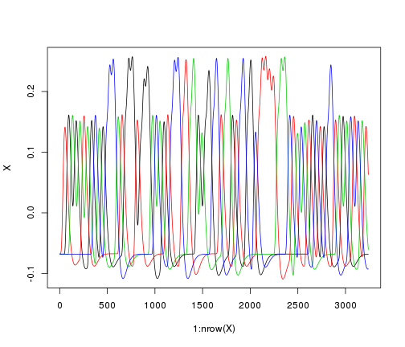
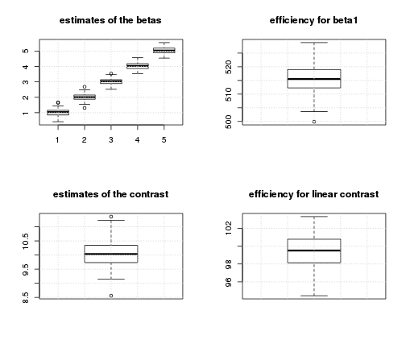

Tests of the efficiency of various fMRI designs
===============================================

Time-stamp: <2013-01-08 17:06 christophe@pallier.org>

We present some simulations comparing the power of designs with fixed ISI to designs with varying ISI. We are interested in the estimates of a linear contrast and of the main effects of each condition versus the baseline. 


```
## Loading required package: MASS
```


```r
ncond <- 8
trialpercond <- 8
stimduration <- 6
SOA <- 8
(totalduration <- (ncond * trialpercond * SOA) + SOA)
```

```
## [1] 520
```


We can generate a paradigm with a fixed SOA...


```r
timing <- generate_paradigm_fixed_SOA(ncond, trialpercond, stimduration, SOA, 
    totalduration)

head(timing)
```

```
##   onsets conditions durations
## 1      0          4         6
## 2      8          5         6
## 3     16          4         6
## 4     24          6         6
## 5     32          2         6
## 6     40          6         6
```


... and build its associated design matrix


```r
X <- create_design_matrix(timing, totalduration)
npoints <- nrow(X)

par(mfrow = c(2, 1))
with(timing, plot(onsets, rep(1, nrow(timing)), col = conditions, type = "h", 
    ylim = c(0, 1.5), ylab = "", xlab = "Time", main = "conditions"))
matplot(1:nrow(X), X, type = "l", col = 1:ncond)
```

 


Simulations and Estimation by an hrf model. 
------------------------------------------

For many such designs, we simulate a voxel where the signal increases in a linear fashion with 'condition' (amplitudes=1:5).


```r

simulations <- function(nsim, listofcontrasts, design_generator, ...) {
    eff <- matrix(nrow = nsim, ncol = length(listofcontrasts))
    for (i in 1:nsim) {
        timing <- design_generator(...)
        X <- create_design_matrix(timing, totalduration)
        for (contrast in listofcontrasts) {
            eff[i, contrast] <- efficiency(listofcontrasts[[contrast]], X)
        }
    }
    eff
}
```


```r
nsim <- 100  # number of simulations

betas <- 1:ncond  # theoretical amplitudes (per condition)

con <- betas - mean(betas)  # contrast of interest
con %*% betas  # value of the contrast to be estimated
```

```
##      [,1]
## [1,]   42
```

```r

estimates <- matrix(nrow = nsim, ncol = ncond)
estimatese <- matrix(nrow = nsim, ncol = ncond)

conestimates <- numeric(nsim)
eff <- numeric(nsim)
beta1eff <- numeric(nsim)

for (sim in 1:nsim) {
    timing <- generate_paradigm_fixed_SOA(ncond, trialpercond, stimduration, 
        SOA, totalduration)
    X <- create_design_matrix(timing, totalduration)
    eff[sim] <- efficiency(con, X)
    beta1eff[sim] <- efficiency(c(1, rep(0, length(betas) - 1)), X)
    y0 <- X %*% betas
    noise <- 5 * scale(rnorm(npoints))
    y <- y0 + noise
    summarylmmod <- summary(lm(y ~ X))
    estimates[sim, ] <- summarylmmod$coefficients[-1, 1]
    estimatese[sim, ] <- summarylmmod$coefficients[-1, 2]
    conestimates[sim] <- con %*% estimates[sim, ]
}
```


Estimation of the last model of the simulation

```r
summary(lm(y ~ X))
```

```
## 
## Call:
## lm(formula = y ~ X)
## 
## Residuals:
##     Min      1Q  Median      3Q     Max 
## -17.766  -3.337   0.045   3.326  20.906 
## 
## Coefficients:
##             Estimate Std. Error t value Pr(>|t|)    
## (Intercept) 6.48e-17   6.94e-02    0.00   1.0000    
## XX1         1.98e+00   6.10e-01    3.24   0.0012 ** 
## XX2         3.19e+00   6.09e-01    5.24  1.7e-07 ***
## XX3         4.26e+00   6.17e-01    6.90  5.7e-12 ***
## XX4         5.34e+00   6.04e-01    8.85  < 2e-16 ***
## XX5         6.16e+00   6.07e-01   10.13  < 2e-16 ***
## XX6         7.27e+00   6.11e-01   11.89  < 2e-16 ***
## XX7         8.24e+00   6.10e-01   13.50  < 2e-16 ***
## XX8         9.19e+00   6.08e-01   15.11  < 2e-16 ***
## ---
## Signif. codes:  0 '***' 0.001 '**' 0.01 '*' 0.05 '.' 0.1 ' ' 1 
## 
## Residual standard error: 5 on 5191 degrees of freedom
## Multiple R-squared: 0.133,	Adjusted R-squared: 0.132 
## F-statistic: 99.8 on 8 and 5191 DF,  p-value: <2e-16 
## 
```


Summaries of estimates of betas and their standard errors

```r
summary(estimates)
```

```
##        V1               V2              V3             V4      
##  Min.   :-0.426   Min.   :0.296   Min.   :1.25   Min.   :2.28  
##  1st Qu.: 0.368   1st Qu.:1.463   1st Qu.:2.29   1st Qu.:3.33  
##  Median : 0.811   Median :1.821   Median :2.71   Median :3.86  
##  Mean   : 0.784   Mean   :1.837   Mean   :2.77   Mean   :3.82  
##  3rd Qu.: 1.236   3rd Qu.:2.218   3rd Qu.:3.25   3rd Qu.:4.25  
##  Max.   : 2.527   Max.   :3.288   Max.   :4.26   Max.   :5.38  
##        V5             V6             V7             V8      
##  Min.   :3.43   Min.   :4.32   Min.   :5.24   Min.   :5.70  
##  1st Qu.:4.40   1st Qu.:5.30   1st Qu.:6.39   1st Qu.:7.46  
##  Median :4.89   Median :5.71   Median :6.88   Median :7.79  
##  Mean   :4.84   Mean   :5.77   Mean   :6.82   Mean   :7.83  
##  3rd Qu.:5.30   3rd Qu.:6.21   3rd Qu.:7.22   3rd Qu.:8.28  
##  Max.   :6.25   Max.   :7.27   Max.   :8.33   Max.   :9.57  
```

```r
summary(estimatese)
```

```
##        V1              V2              V3              V4       
##  Min.   :0.603   Min.   :0.603   Min.   :0.602   Min.   :0.604  
##  1st Qu.:0.608   1st Qu.:0.607   1st Qu.:0.608   1st Qu.:0.608  
##  Median :0.610   Median :0.609   Median :0.609   Median :0.609  
##  Mean   :0.610   Mean   :0.609   Mean   :0.610   Mean   :0.609  
##  3rd Qu.:0.611   3rd Qu.:0.611   3rd Qu.:0.611   3rd Qu.:0.610  
##  Max.   :0.618   Max.   :0.620   Max.   :0.620   Max.   :0.618  
##        V5              V6              V7              V8       
##  Min.   :0.602   Min.   :0.603   Min.   :0.602   Min.   :0.601  
##  1st Qu.:0.608   1st Qu.:0.609   1st Qu.:0.608   1st Qu.:0.609  
##  Median :0.609   Median :0.610   Median :0.610   Median :0.609  
##  Mean   :0.610   Mean   :0.610   Mean   :0.609   Mean   :0.610  
##  3rd Qu.:0.610   3rd Qu.:0.611   3rd Qu.:0.611   3rd Qu.:0.611  
##  Max.   :0.619   Max.   :0.618   Max.   :0.619   Max.   :0.619  
```


```r
par(mfrow = c(2, 2))
# distributions of estimates of individual betas
boxplot(estimates, main = "estimates of the betas")
grid()
boxplot(beta1eff, main = "efficiency for beta1")
grid()

# distribution of estimate of the contrasts
boxplot(conestimates, main = "estimates of the contrast")
grid()
boxplot(eff, main = "efficiency for linear contrast")
grid()
```

 


The average standard deviation of the estimates of the betas is:


```r
mean(apply(estimates, 2, sd))
```

```
## [1] 0.6369
```


Remark that the variability in the estimates depends: (a) on the variability of the design matrices and (b) on the noise. 


New design, with jitter between trials:
--------------------------------------

Now, we jitter the SOA between trials and run a similar simulation.


```r
timing <- generate_paradigm_fixed_SOA(ncond, trialpercond, stimduration, SOA, 
    totalduration)
ntrials <- nrow(timing)
jitter <- 4
timing$onsets <- abs(timing$onsets + runif(ntrials, min = -jitter/2, max = jitter/2))
head(timing)
```

```
##   onsets conditions durations
## 1  1.033          2         6
## 2  8.948          5         6
## 3 14.815          3         6
## 4 24.891          3         6
## 5 31.387          2         6
## 6 40.978          1         6
```

```r
par(mfcol = c(1, 1))
hist(diff(timing$onsets, main = "Distribution of SOAs"))
```

 


```r
X <- create_design_matrix(timing, totalduration)
npoints <- nrow(X)

par(mfrow = c(2, 1))
with(timing, plot(onsets, rep(1, nrow(timing)), col = conditions, type = "h", 
    ylim = c(0, 1.5), ylab = "", xlab = "Time", main = "conditions"))
matplot(1:nrow(X), X, type = "l", col = 1:ncond)
```

 


```r
nsim <- 100  # number of simulations
betas <- 1:ncond  # theoretical amplitudes (per condition)
con <- betas - mean(betas)
con %*% betas  # value of the contrast to be estimated
```

```
##      [,1]
## [1,]   42
```

```r

estimates <- matrix(nrow = nsim, ncol = ncond)
estimatese <- matrix(nrow = nsim, ncol = ncond)

eff <- numeric(nsim)
for (sim in 1:nsim) {
    timing <- generate_paradigm_fixed_SOA(ncond, trialpercond, stimduration, 
        SOA, totalduration)
    ntrials <- nrow(timing)
    # introducing some random jittering
    timing$onsets <- abs(timing$onsets + runif(ntrials, min = -jitter/2, max = jitter/2))
    X <- create_design_matrix(timing, totalduration)
    eff[sim] <- efficiency(con, X)
    beta1eff[sim] <- efficiency(c(1, rep(0, length(betas) - 1)), X)
    y0 <- X %*% betas
    noise <- 5 * scale(rnorm(npoints))
    y <- y0 + noise
    summarylmmod <- summary(lm(y ~ X))
    estimates[sim, ] <- summarylmmod$coefficients[-1, 1]
    estimatese[sim, ] <- summarylmmod$coefficients[-1, 2]
    
    conestimates[sim] <- con %*% estimates[sim, ]
}
```


```r
summary(lm(y ~ X))
```

```
## 
## Call:
## lm(formula = y ~ X)
## 
## Residuals:
##     Min      1Q  Median      3Q     Max 
## -18.262  -3.362  -0.013   3.476  20.972 
## 
## Coefficients:
##             Estimate Std. Error t value Pr(>|t|)    
## (Intercept) 6.45e-17   6.94e-02    0.00     1.00    
## XX1         8.97e-01   3.86e-01    2.32     0.02 *  
## XX2         1.79e+00   3.64e-01    4.92  8.7e-07 ***
## XX3         3.14e+00   3.69e-01    8.50  < 2e-16 ***
## XX4         3.96e+00   3.71e-01   10.67  < 2e-16 ***
## XX5         5.06e+00   3.74e-01   13.56  < 2e-16 ***
## XX6         5.58e+00   3.73e-01   14.96  < 2e-16 ***
## XX7         7.11e+00   3.61e-01   19.72  < 2e-16 ***
## XX8         7.61e+00   3.86e-01   19.71  < 2e-16 ***
## ---
## Signif. codes:  0 '***' 0.001 '**' 0.01 '*' 0.05 '.' 0.1 ' ' 1 
## 
## Residual standard error: 5 on 5191 degrees of freedom
## Multiple R-squared: 0.149,	Adjusted R-squared: 0.147 
## F-statistic:  113 on 8 and 5191 DF,  p-value: <2e-16 
## 
```


Summaries of estimates of betas and their standard errors

```r
summary(estimates)
```

```
##        V1               V2             V3             V4      
##  Min.   :-0.164   Min.   :1.15   Min.   :2.32   Min.   :3.05  
##  1st Qu.: 0.697   1st Qu.:1.79   1st Qu.:2.78   1st Qu.:3.76  
##  Median : 1.012   Median :2.04   Median :2.98   Median :4.00  
##  Mean   : 0.967   Mean   :2.02   Mean   :3.02   Mean   :4.01  
##  3rd Qu.: 1.223   3rd Qu.:2.31   3rd Qu.:3.26   3rd Qu.:4.25  
##  Max.   : 1.776   Max.   :2.68   Max.   :4.06   Max.   :4.93  
##        V5             V6             V7             V8      
##  Min.   :4.16   Min.   :5.12   Min.   :6.00   Min.   :6.94  
##  1st Qu.:4.82   1st Qu.:5.70   1st Qu.:6.82   1st Qu.:7.72  
##  Median :5.02   Median :5.99   Median :7.06   Median :8.02  
##  Mean   :5.03   Mean   :5.99   Mean   :7.06   Mean   :7.99  
##  3rd Qu.:5.23   3rd Qu.:6.31   3rd Qu.:7.36   3rd Qu.:8.26  
##  Max.   :6.04   Max.   :6.91   Max.   :7.89   Max.   :8.83  
```

```r
summary(estimatese)
```

```
##        V1              V2              V3              V4       
##  Min.   :0.333   Min.   :0.350   Min.   :0.336   Min.   :0.340  
##  1st Qu.:0.363   1st Qu.:0.366   1st Qu.:0.367   1st Qu.:0.364  
##  Median :0.378   Median :0.375   Median :0.378   Median :0.377  
##  Mean   :0.376   Mean   :0.377   Mean   :0.378   Mean   :0.376  
##  3rd Qu.:0.386   3rd Qu.:0.385   3rd Qu.:0.390   3rd Qu.:0.387  
##  Max.   :0.425   Max.   :0.425   Max.   :0.422   Max.   :0.413  
##        V5              V6              V7              V8       
##  Min.   :0.344   Min.   :0.339   Min.   :0.332   Min.   :0.332  
##  1st Qu.:0.365   1st Qu.:0.365   1st Qu.:0.365   1st Qu.:0.363  
##  Median :0.376   Median :0.372   Median :0.374   Median :0.377  
##  Mean   :0.377   Mean   :0.375   Mean   :0.376   Mean   :0.377  
##  3rd Qu.:0.385   3rd Qu.:0.385   3rd Qu.:0.387   3rd Qu.:0.389  
##  Max.   :0.420   Max.   :0.421   Max.   :0.424   Max.   :0.413  
```


```r
par(mfrow = c(2, 2))
# distributions of estimates of individual betas
boxplot(estimates, main = "estimates of the betas")
grid()
boxplot(beta1eff, main = "efficiency for beta1")
grid()

# distribution of estimate of the contrasts
boxplot(conestimates, main = "estimates of the contrast")
grid()
boxplot(eff, main = "efficiency for linear contrast")
grid()
```

 


The average standard deviation of the estimates of the betas is:


```r
mean(apply(estimates, 2, sd))
```

```
## [1] 0.3842
```


First conclusion
----------------

The efficiency for the linear contrast is about the same for the two types of design, but individual betas are better estimated with jittering. But we have not included null events yet.  

Simulations with 'explicit' NULL events
---------------------------------------

Coming back to the fixed SOA schedule, we now add a sixth condition, consisting of silent trials of the same duration as the 'real' trials.


```r
ncond <- 6
trialpercond <- 20
stimduration <- 6
SOA <- 10
(totalduration <- (ncond * trialpercond * SOA) + SOA)
```

```
## [1] 1210
```

```r


nsim <- 100  # number of simulations
betas <- c(1:5, 0)  # theoretical amplitudes (per condition)

con <- c((1:5) - mean(1:5), 0)  # contrast of interest
con %*% betas  # value of the contrast to be estimated
```

```
##      [,1]
## [1,]   10
```

```r

estimates <- matrix(nrow = nsim, ncol = ncond)
estimatese <- matrix(nrow = nsim, ncol = ncond)
conestimates <- numeric(nsim)
eff <- numeric(nsim)
beta1eff <- numeric(nsim)

for (sim in 1:nsim) {
    timing <- generate_paradigm_fixed_SOA(ncond, trialpercond, stimduration, 
        SOA, totalduration)
    X <- create_design_matrix(timing, totalduration)
    eff[sim] <- efficiency(con, X)
    beta1eff[sim] <- efficiency(c(1, rep(0, length(betas) - 1)), X)
    y0 <- X %*% betas
    noise <- 5 * scale(rnorm(length(y0)))
    y <- y0 + noise
    summarylmmod <- summary(lm(y ~ X))
    estimates[sim, ] <- summarylmmod$coefficients[-1, 1]
    estimatese[sim, ] <- summarylmmod$coefficients[-1, 2]
    conestimates[sim] <- con %*% estimates[sim, ]
}
```


```r
summary(lm(y ~ X))
```

```
## 
## Call:
## lm(formula = y ~ X)
## 
## Residuals:
##     Min      1Q  Median      3Q     Max 
## -20.140  -3.414   0.007   3.400  18.691 
## 
## Coefficients:
##             Estimate Std. Error t value Pr(>|t|)    
## (Intercept) 8.45e-17   4.55e-02    0.00     1.00    
## XX1         1.28e+00   2.78e-01    4.60  4.3e-06 ***
## XX2         2.09e+00   2.78e-01    7.50  6.8e-14 ***
## XX3         3.29e+00   2.79e-01   11.80  < 2e-16 ***
## XX4         4.45e+00   2.78e-01   16.00  < 2e-16 ***
## XX5         5.05e+00   2.78e-01   18.16  < 2e-16 ***
## XX6         2.57e-01   2.77e-01    0.93     0.35    
## ---
## Signif. codes:  0 '***' 0.001 '**' 0.01 '*' 0.05 '.' 0.1 ' ' 1 
## 
## Residual standard error: 5 on 12093 degrees of freedom
## Multiple R-squared: 0.0639,	Adjusted R-squared: 0.0635 
## F-statistic:  138 on 6 and 12093 DF,  p-value: <2e-16 
## 
```


Summaries of estimates of betas and their standard errors

```r
summary(estimates)
```

```
##        V1               V2             V3             V4      
##  Min.   :0.0885   Min.   :1.38   Min.   :2.40   Min.   :3.39  
##  1st Qu.:0.7817   1st Qu.:1.79   1st Qu.:2.79   1st Qu.:3.78  
##  Median :0.9851   Median :1.97   Median :2.98   Median :3.99  
##  Mean   :0.9955   Mean   :1.98   Mean   :3.00   Mean   :4.00  
##  3rd Qu.:1.2354   3rd Qu.:2.16   3rd Qu.:3.20   3rd Qu.:4.20  
##  Max.   :1.8420   Max.   :2.60   Max.   :3.68   Max.   :4.71  
##        V5             V6         
##  Min.   :4.16   Min.   :-0.5854  
##  1st Qu.:4.76   1st Qu.:-0.2031  
##  Median :5.03   Median : 0.0386  
##  Mean   :5.01   Mean   : 0.0179  
##  3rd Qu.:5.23   3rd Qu.: 0.2167  
##  Max.   :5.55   Max.   : 0.6159  
```

```r
summary(estimatese)
```

```
##        V1              V2              V3              V4       
##  Min.   :0.276   Min.   :0.277   Min.   :0.276   Min.   :0.276  
##  1st Qu.:0.278   1st Qu.:0.278   1st Qu.:0.278   1st Qu.:0.278  
##  Median :0.278   Median :0.278   Median :0.278   Median :0.278  
##  Mean   :0.278   Mean   :0.278   Mean   :0.278   Mean   :0.278  
##  3rd Qu.:0.278   3rd Qu.:0.278   3rd Qu.:0.278   3rd Qu.:0.278  
##  Max.   :0.279   Max.   :0.279   Max.   :0.280   Max.   :0.279  
##        V5              V6       
##  Min.   :0.277   Min.   :0.276  
##  1st Qu.:0.278   1st Qu.:0.277  
##  Median :0.278   Median :0.278  
##  Mean   :0.278   Mean   :0.278  
##  3rd Qu.:0.278   3rd Qu.:0.278  
##  Max.   :0.280   Max.   :0.279  
```


```r
par(mfrow = c(2, 2))
# distributions of estimates of individual betas
boxplot(estimates, main = "estimates of the betas")
grid()
boxplot(beta1eff, main = "efficiency for beta1")
grid()

# distribution of estimate of the contrasts
boxplot(conestimates, main = "estimates of the contrast")
grid()
boxplot(eff, main = "efficiency for linear contrast")
grid()
```

 


The average standard deviation of the estimates of the betas is:


```r
mean(apply(estimates, 2, sd))
```

```
## [1] 0.2847
```


And now, the same total amount of silence is inserted as NULL events of varying length between the 'real' trials, introducing jitter.


```r
ncond <- 5
trialpercond <- 20
stimduration <- 6
SOA <- 10
(totalduration0 <- (ncond * trialpercond * SOA) + SOA)
```

```
## [1] 1010
```

```r

betas <- 1:ncond
con <- betas - mean(betas)  # contrast of interest
con %*% betas  # value of the contrast to be estimated
```

```
##      [,1]
## [1,]   10
```

```r

nsim <- 100
estimates <- matrix(nrow = nsim, ncol = ncond)
estimatese <- matrix(nrow = nsim, ncol = ncond)
conestimates <- numeric(nsim)
eff <- numeric(nsim)
beta1eff <- numeric(nsim)

for (sim in 1:nsim) {
    timing <- generate_paradigm_fixed_SOA(ncond, trialpercond, stimduration, 
        SOA, totalduration0)
    # insert silences
    totalsilence <- trialpercond * SOA
    totalduration <- totalduration0 + totalsilence
    ntrials <- ncond * trialpercond
    silences <- runif(ntrials, 0.2, 1.8) * (totalsilence/ntrials)
    silences <- silences * (totalsilence/sum(silences))
    timing$onsets <- timing$onsets + cumsum(silences)
    
    X <- create_design_matrix(timing, totalduration)
    eff[sim] <- efficiency(con, X)
    beta1eff[sim] <- efficiency(c(1, rep(0, length(betas) - 1)), X)
    y0 <- X %*% betas
    noise <- 5 * scale(rnorm(length(y0)))
    y <- y0 + noise
    summarylmmod <- summary(lm(y ~ X))
    estimates[sim, ] <- summarylmmod$coefficients[-1, 1]
    estimatese[sim, ] <- summarylmmod$coefficients[-1, 2]
    conestimates[sim] <- con %*% estimates[sim, ]
}
```


```r
summary(lm(y ~ X))
```

```
## 
## Call:
## lm(formula = y ~ X)
## 
## Residuals:
##     Min      1Q  Median      3Q     Max 
## -21.860  -3.377  -0.019   3.393  20.941 
## 
## Coefficients:
##             Estimate Std. Error t value Pr(>|t|)    
## (Intercept) 3.62e-17   4.55e-02    0.00        1    
## XX1         1.26e+00   2.22e-01    5.69  1.3e-08 ***
## XX2         2.11e+00   2.21e-01    9.55  < 2e-16 ***
## XX3         3.13e+00   2.18e-01   14.33  < 2e-16 ***
## XX4         4.21e+00   2.20e-01   19.15  < 2e-16 ***
## XX5         5.30e+00   2.20e-01   24.04  < 2e-16 ***
## ---
## Signif. codes:  0 '***' 0.001 '**' 0.01 '*' 0.05 '.' 0.1 ' ' 1 
## 
## Residual standard error: 5 on 12094 degrees of freedom
## Multiple R-squared: 0.0591,	Adjusted R-squared: 0.0588 
## F-statistic:  152 on 5 and 12094 DF,  p-value: <2e-16 
## 
```


Summaries of estimates of betas and their standard errors

```r
summary(estimates)
```

```
##        V1              V2             V3             V4      
##  Min.   :0.413   Min.   :1.31   Min.   :2.52   Min.   :3.54  
##  1st Qu.:0.858   1st Qu.:1.87   1st Qu.:2.89   1st Qu.:3.87  
##  Median :1.037   Median :2.01   Median :3.04   Median :4.04  
##  Mean   :1.019   Mean   :2.01   Mean   :3.02   Mean   :4.03  
##  3rd Qu.:1.151   3rd Qu.:2.14   3rd Qu.:3.14   3rd Qu.:4.18  
##  Max.   :1.667   Max.   :2.68   Max.   :3.54   Max.   :4.57  
##        V5      
##  Min.   :4.55  
##  1st Qu.:4.89  
##  Median :5.03  
##  Mean   :5.04  
##  3rd Qu.:5.19  
##  Max.   :5.55  
```

```r
summary(estimatese)
```

```
##        V1              V2              V3              V4       
##  Min.   :0.217   Min.   :0.218   Min.   :0.218   Min.   :0.218  
##  1st Qu.:0.220   1st Qu.:0.220   1st Qu.:0.220   1st Qu.:0.220  
##  Median :0.220   Median :0.220   Median :0.220   Median :0.220  
##  Mean   :0.220   Mean   :0.220   Mean   :0.220   Mean   :0.220  
##  3rd Qu.:0.221   3rd Qu.:0.221   3rd Qu.:0.221   3rd Qu.:0.221  
##  Max.   :0.224   Max.   :0.224   Max.   :0.223   Max.   :0.224  
##        V5       
##  Min.   :0.218  
##  1st Qu.:0.220  
##  Median :0.220  
##  Mean   :0.220  
##  3rd Qu.:0.221  
##  Max.   :0.224  
```


```r
par(mfrow = c(2, 2))
# distributions of estimates of individual betas
boxplot(estimates, main = "estimates of the betas")
grid()
boxplot(beta1eff, main = "efficiency for beta1")
grid()
mean(apply(estimates, 2, sd))
```

```
## [1] 0.2079
```

```r

# distribution of estimate of the contrasts
boxplot(conestimates, main = "estimates of the contrast")
grid()
boxplot(eff, main = "efficiency for linear contrast")
grid()
```

 


Conclusions
-----------

For the linear contrast, the two two types of designs provide similar power. For the estimation of the betas, the paradigms with varying ISI perform better.

However, our simulations looked at the general behavior of the paradigm types. We can select the best schedules from a class of paradigm.

