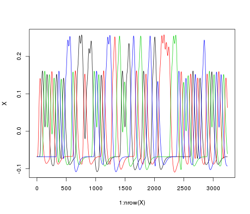
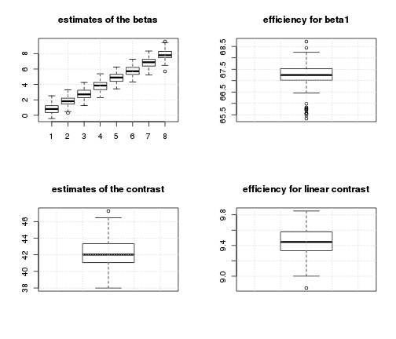
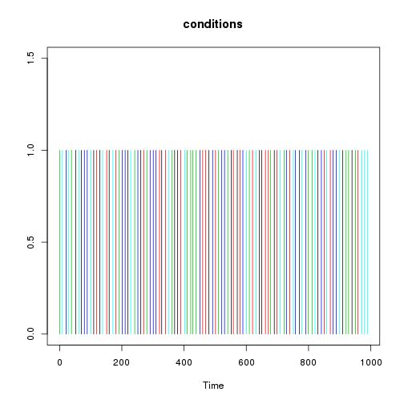
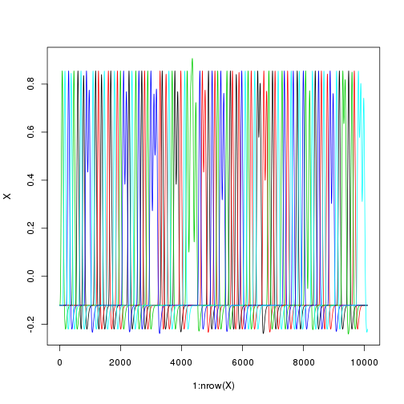
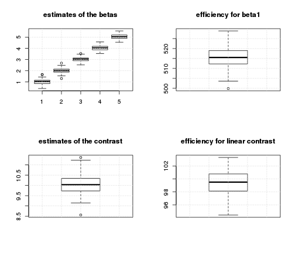

Tests of the efficiency of various fMRI designs
===============================================

Time-stamp: <2013-01-08 17:06 christophe@pallier.org>

Note: This document is generated from the source file "simul5.Rmd", a Rmarkdown document that can be edited, e.g., with rstudio.

We present some simulations comparing the power of designs with fixed ISI to designs with varying ISI. We are interested in how precise are the estimates of the parameters associated to each condition.


```
## Loading required package: MASS
```


We define various ways of generating paradigms: 


```r
generate_paradigm_fixed_SOA <- function(ncond, trialpercond, stimduration, SOA, 
    totalduration) # ncond os the number of different experimental conditions stimduration,
# SOA and totalduration must be expressed in seconds
{
    ntrials <- ncond * trialpercond
    conditions <- sample(rep(1:ncond, trialpercond))
    onsets <- (1:ntrials - 1) * SOA
    durations <- rep(stimduration, ntrials)
    timing <- data.frame(onsets, conditions, durations)
    timing
}

generate_paradigm_fixed_SOA_adding_silences <- function(ncond, trialpercond, 
    stimduration, SOA, totalduration0) {
    # we simply add one more condition 'silence' having as many trials as the
    # others, lengthening the whole duration by 'trialpercond*SOA'
    timing <- generate_paradigm_fixed_SOA(ncond + 1, trialpercond, stimduration, 
        SOA, totalduration0 + trialpercond * SOA)
    # and delete the references to it (it will be in the implicit baseline)
    timing <- subset(timing, conditions != ncond + 1)
    timing
}

generate_paradigm_varying_SOA <- function(ncond, trialpercond, stimduration, 
    SOA, jitter, totalduration) {
    # first, we computed a fixed SOA design
    timing <- generate_paradigm_fixed_SOA(ncond, trialpercond, stimduration, 
        SOA, totalduration)
    ntrials <- nrow(timing)
    # introducing some random jittering around '0' between the trials
    timing$onsets <- abs(timing$onsets + runif(ntrials, min = -jitter/2, max = jitter/2))
    timing
}

generate_paradigm_varying_SOA_null_events <- function(ncond, trialpercond, stimduration, 
    SOA, totalduration) {
    timing <- generate_paradigm_fixed_SOA(ncond, trialpercond, stimduration, 
        SOA, totalduration)
    # insert silences. This will lengthen the whole by trialpercond*SOA
    totalsilence <- trialpercond * SOA
    totalduration <- totalduration + totalsilence
    ntrials <- ncond * trialpercond
    silences <- runif(ntrials, 0.2, 1.8) * (totalsilence/ntrials)
    silences <- silences * (totalsilence/sum(silences))
    timing$onsets <- timing$onsets + cumsum(silences)
    timing
}
```


```r
ncond <- 5
trialpercond <- 20
stimduration <- 6
SOA <- 10
(totalduration <- (ncond * trialpercond * SOA) + SOA)
```

```
## [1] 1010
```


We can generate a paradigm with a fixed SOA...


```r
timing <- generate_paradigm_fixed_SOA(ncond, trialpercond, stimduration, SOA, 
    totalduration)

head(timing)
```

```
##   onsets conditions durations
## 1      0          3         6
## 2     10          1         6
## 3     20          3         6
## 4     30          3         6
## 5     40          5         6
## 6     50          2         6
```


... and build its associated design matrix


```r
X <- create_design_matrix(timing, totalduration)
par(mfrow = c(2, 1))
plot_paradigm(timing)
plot_design_matrix(X)
```

 


Simulations and Estimation by an hrf model. 
------------------------------------------

For many such designs, we simulate a voxel where the signal increases in a linear fashion with 'condition' (amplitudes=1:5).


```r

normalnoise <- function(npoints) {
    5 * rnorm(npoints)
}

simulations <- function(nsim, beta, listofcontrasts, noise_fun, design_generator, 
    ...) {
    estimates <- matrix(nrow = nsim, ncol = length(beta))
    estimatese <- matrix(nrow = nsim, ncol = length(beta))
    efficiencies <- matrix(nrow = nsim, ncol = length(listofcontrasts))
    
    for (i in 1:nsim) {
        timing <- design_generator(...)
        X <- create_design_matrix(timing, totalduration)
        
        # simulate a time-series
        y0 <- X %*% beta
        y <- y0 + noise_fun(length(y0))
        
        # analyse using a linear model
        m <- summary(lm(y ~ X))
        estimates[i, ] <- m$coefficients[-1, 1]  # get the estimations of the parameters
        estimatese[i, ] <- m$coefficients[-1, 2]  # and their associated standard errors
        
        # compute the efficiency of contrasts
        for (contrast in 1:length(listofcontrasts)) {
            efficiencies[i, contrast] <- efficiency(listofcontrasts[[contrast]], 
                X)
        }
        
    }
    # returns the estimates, their s.e. and the efficiencies
    list(estimates = estimates, estimatese = estimatese, efficiencies = efficiencies)
}
```


```r
nsim <- 10  # number of simulations

betas <- 1:ncond  # theoretical amplitudes (per condition)

con <- betas - mean(betas)  # contrast of interest
con %*% betas  # value of the contrast to be estimated
```

```
##      [,1]
## [1,]   10
```

```r

estimates <- matrix(nrow = nsim, ncol = ncond)
estimatese <- matrix(nrow = nsim, ncol = ncond)

conestimates <- numeric(nsim)
eff <- numeric(nsim)
beta1eff <- numeric(nsim)

for (sim in 1:nsim) {
    timing <- generate_paradigm_fixed_SOA(ncond, trialpercond, stimduration, 
        SOA, totalduration)
    X <- create_design_matrix(timing, totalduration)
    eff[sim] <- efficiency(con, X)
    beta1eff[sim] <- efficiency(c(1, rep(0, length(betas) - 1)), X)
    y0 <- X %*% betas
    noise <- 5 * scale(rnorm(length(y0)))
    y <- y0 + noise
    summarylmmod <- summary(lm(y ~ X))
    estimates[sim, ] <- summarylmmod$coefficients[-1, 1]
    estimatese[sim, ] <- summarylmmod$coefficients[-1, 2]
    conestimates[sim] <- con %*% estimates[sim, ]
}
```


Estimation of the last model of the simulation

```r
summary(lm(y ~ X))
```

```
## 
## Call:
## lm(formula = y ~ X)
## 
## Residuals:
##     Min      1Q  Median      3Q     Max 
## -24.002  -3.391  -0.015   3.351  21.281 
## 
## Coefficients:
##             Estimate Std. Error t value Pr(>|t|)    
## (Intercept) 4.51e-17   4.98e-02    0.00    1.000    
## XX1         6.79e-01   2.93e-01    2.32    0.021 *  
## XX2         1.69e+00   2.95e-01    5.74  9.9e-09 ***
## XX3         2.93e+00   2.95e-01    9.93  < 2e-16 ***
## XX4         3.93e+00   2.93e-01   13.41  < 2e-16 ***
## XX5         4.81e+00   2.94e-01   16.36  < 2e-16 ***
## ---
## Signif. codes:  0 '***' 0.001 '**' 0.01 '*' 0.05 '.' 0.1 ' ' 1 
## 
## Residual standard error: 5 on 10094 degrees of freedom
## Multiple R-squared: 0.0522,	Adjusted R-squared: 0.0517 
## F-statistic:  111 on 5 and 10094 DF,  p-value: <2e-16 
## 
```


Summaries of estimates of betas and their standard errors

```r
summary(estimates)
```

```
##        V1              V2             V3             V4      
##  Min.   :0.548   Min.   :1.50   Min.   :2.22   Min.   :3.27  
##  1st Qu.:0.626   1st Qu.:1.70   1st Qu.:2.77   1st Qu.:3.70  
##  Median :0.757   Median :1.78   Median :2.81   Median :3.84  
##  Mean   :0.808   Mean   :1.85   Mean   :2.79   Mean   :3.82  
##  3rd Qu.:1.007   3rd Qu.:2.01   3rd Qu.:2.91   3rd Qu.:4.03  
##  Max.   :1.152   Max.   :2.26   Max.   :3.17   Max.   :4.23  
##        V5      
##  Min.   :4.45  
##  1st Qu.:4.66  
##  Median :4.80  
##  Mean   :4.83  
##  3rd Qu.:4.99  
##  Max.   :5.43  
```

```r
summary(estimatese)
```

```
##        V1              V2              V3              V4       
##  Min.   :0.293   Min.   :0.293   Min.   :0.293   Min.   :0.293  
##  1st Qu.:0.294   1st Qu.:0.293   1st Qu.:0.294   1st Qu.:0.294  
##  Median :0.294   Median :0.294   Median :0.294   Median :0.294  
##  Mean   :0.294   Mean   :0.294   Mean   :0.294   Mean   :0.294  
##  3rd Qu.:0.294   3rd Qu.:0.294   3rd Qu.:0.294   3rd Qu.:0.294  
##  Max.   :0.295   Max.   :0.296   Max.   :0.295   Max.   :0.295  
##        V5       
##  Min.   :0.293  
##  1st Qu.:0.294  
##  Median :0.294  
##  Mean   :0.294  
##  3rd Qu.:0.294  
##  Max.   :0.295  
```


```r
par(mfrow = c(2, 2))
# distributions of estimates of individual betas
boxplot(estimates, main = "estimates of the betas")
grid()
boxplot(beta1eff, main = "efficiency for beta1")
grid()

# distribution of estimate of the contrasts
boxplot(conestimates, main = "estimates of the contrast")
grid()
boxplot(eff, main = "efficiency for linear contrast")
grid()
```

 


The average standard deviation of the estimates of the betas is:


```r
mean(apply(estimates, 2, sd))
```

```
## [1] 0.2565
```


Remark that the variability in the estimates depends: (a) on the variability of the design matrices and (b) on the noise. 


```r
o <- simulations(nsim = 10, beta = 1:ncond, listofcontrasts = list((1:5) - 2.5, 
    c(1, 0, 0, 0, 0)), normalnoise, generate_paradigm_fixed_SOA, ncond, trialpercond, 
    stimduration, SOA, totalduration)

par(mfcol = c(1, 2))
boxplot(o$estimates)
mean(unlist(o$estimatese))
```

```
## [1] 0.2942
```

```r
boxplot(o$efficiencies)
```

 


New design, with jitter between trials:
--------------------------------------

Now, we jitter the SOA between trials and run a similar simulation.


```r
timing <- generate_paradigm_fixed_SOA(ncond, trialpercond, stimduration, SOA, 
    totalduration)
ntrials <- nrow(timing)
jitter <- 4
timing$onsets <- abs(timing$onsets + runif(ntrials, min = -jitter/2, max = jitter/2))
head(timing)
```

```
##   onsets conditions durations
## 1  1.299          2         6
## 2 10.837          5         6
## 3 21.721          3         6
## 4 28.319          2         6
## 5 40.038          5         6
## 6 50.621          4         6
```

```r
par(mfcol = c(1, 1))
hist(diff(timing$onsets, main = "Distribution of SOAs"))
```

 


```r
X <- create_design_matrix(timing, totalduration)
par(mfrow = c(2, 1))
plot_paradigm(timing)
plot_design_matrix(X)
```

 


```r
# nsim <- 100 # number of simulations
betas <- 1:ncond  # theoretical amplitudes (per condition)
con <- betas - mean(betas)
con %*% betas  # value of the contrast to be estimated
```

```
##      [,1]
## [1,]   10
```

```r

estimates <- matrix(nrow = nsim, ncol = ncond)
estimatese <- matrix(nrow = nsim, ncol = ncond)

eff <- numeric(nsim)
for (sim in 1:nsim) {
    timing <- generate_paradigm_fixed_SOA(ncond, trialpercond, stimduration, 
        SOA, totalduration)
    ntrials <- nrow(timing)
    # introducing some random jittering
    timing$onsets <- abs(timing$onsets + runif(ntrials, min = -jitter/2, max = jitter/2))
    X <- create_design_matrix(timing, totalduration)
    eff[sim] <- efficiency(con, X)
    beta1eff[sim] <- efficiency(c(1, rep(0, length(betas) - 1)), X)
    y0 <- X %*% betas
    noise <- 5 * scale(rnorm(npoints))
    y <- y0 + noise
    summarylmmod <- summary(lm(y ~ X))
    estimates[sim, ] <- summarylmmod$coefficients[-1, 1]
    estimatese[sim, ] <- summarylmmod$coefficients[-1, 2]
    
    conestimates[sim] <- con %*% estimates[sim, ]
}
```

```
## Error: object 'npoints' not found
```


```r
summary(lm(y ~ X))
```

```
## 
## Call:
## lm(formula = y ~ X)
## 
## Residuals:
##     Min      1Q  Median      3Q     Max 
## -25.525  -3.505  -0.058   3.445  21.681 
## 
## Coefficients:
##             Estimate Std. Error t value Pr(>|t|)    
## (Intercept) 6.27e-18   5.10e-02    0.00  1.00000    
## XX1         1.16e+00   2.42e-01    4.79  1.7e-06 ***
## XX2         9.28e-01   2.42e-01    3.84  0.00012 ***
## XX3         1.25e+00   2.51e-01    4.99  6.2e-07 ***
## XX4         1.11e+00   2.49e-01    4.45  8.7e-06 ***
## XX5         1.23e+00   2.50e-01    4.89  1.0e-06 ***
## ---
## Signif. codes:  0 '***' 0.001 '**' 0.01 '*' 0.05 '.' 0.1 ' ' 1 
## 
## Residual standard error: 5.13 on 10094 degrees of freedom
## Multiple R-squared: 0.00335,	Adjusted R-squared: 0.00286 
## F-statistic: 6.79 on 5 and 10094 DF,  p-value: 2.48e-06 
## 
```


Summaries of estimates of betas and their standard errors

```r
summary(estimates)
```

```
##     V1             V2             V3             V4         
##  Mode:logical   Mode:logical   Mode:logical   Mode:logical  
##  NA's:10        NA's:10        NA's:10        NA's:10       
##     V5         
##  Mode:logical  
##  NA's:10       
```

```r
summary(estimatese)
```

```
##     V1             V2             V3             V4         
##  Mode:logical   Mode:logical   Mode:logical   Mode:logical  
##  NA's:10        NA's:10        NA's:10        NA's:10       
##     V5         
##  Mode:logical  
##  NA's:10       
```


```r
par(mfrow = c(2, 2))
# distributions of estimates of individual betas
boxplot(estimates, main = "estimates of the betas")
```

```
## Warning: no non-missing arguments to min; returning Inf
```

```
## Warning: no non-missing arguments to max; returning -Inf
```

```
## Error: need finite 'ylim' values
```

```r
grid()
boxplot(beta1eff, main = "efficiency for beta1")
grid()

# distribution of estimate of the contrasts
boxplot(conestimates, main = "estimates of the contrast")
grid()
boxplot(eff, main = "efficiency for linear contrast")
grid()
```

 


The average standard deviation of the estimates of the betas is:


```r
mean(apply(estimates, 2, sd))
```

```
## [1] NA
```


```r

timing <- generate_paradigm_varying_SOA(ncond, trialpercond, stimduration, 4, 
    SOA, totalduration)
plot_paradigm(timing)
```

 

```r
X <- create_design_matrix(timing, totalduration)
plot_design_matrix(X)
```

 

```r

o <- simulations(nsim = 10, beta = 1:ncond, listofcontrasts = list((1:5) - 2.5, 
    c(1, 0, 0, 0, 0)), normalnoise, generate_paradigm_varying_SOA, ncond, trialpercond, 
    stimduration, 4, SOA, totalduration)

par(mfcol = c(1, 2))
boxplot(o$estimates)
mean(unlist(o$estimatese))
```

```
## [1] 0.1872
```

```r
boxplot(o$efficiencies)
```

 


First conclusion
----------------

The efficiency for the linear contrast is about the same for the two types of design, but individual betas are better estimated with jittering. But we have not included null events yet.  

Simulations with 'explicit' NULL events
---------------------------------------

Coming back to the fixed SOA schedule, we now add a sixth condition, consisting of silent trials of the same duration as the 'real' trials.


```r
ncond <- 6
trialpercond <- 20
stimduration <- 6
SOA <- 10
(totalduration <- (ncond * trialpercond * SOA) + SOA)
```

```
## [1] 1210
```

```r


# nsim <- 100 # number of simulations
betas <- c(1:5, 0)  # theoretical amplitudes (per condition)

con <- c((1:5) - mean(1:5), 0)  # contrast of interest
con %*% betas  # value of the contrast to be estimated
```

```
##      [,1]
## [1,]   10
```

```r

estimates <- matrix(nrow = nsim, ncol = ncond)
estimatese <- matrix(nrow = nsim, ncol = ncond)
conestimates <- numeric(nsim)
eff <- numeric(nsim)
beta1eff <- numeric(nsim)

for (sim in 1:nsim) {
    timing <- generate_paradigm_fixed_SOA(ncond, trialpercond, stimduration, 
        SOA, totalduration)
    X <- create_design_matrix(timing, totalduration)
    eff[sim] <- efficiency(con, X)
    beta1eff[sim] <- efficiency(c(1, rep(0, length(betas) - 1)), X)
    y0 <- X %*% betas
    noise <- 5 * scale(rnorm(length(y0)))
    y <- y0 + noise
    summarylmmod <- summary(lm(y ~ X))
    estimates[sim, ] <- summarylmmod$coefficients[-1, 1]
    estimatese[sim, ] <- summarylmmod$coefficients[-1, 2]
    conestimates[sim] <- con %*% estimates[sim, ]
}
```


```r
summary(lm(y ~ X))
```

```
## 
## Call:
## lm(formula = y ~ X)
## 
## Residuals:
##     Min      1Q  Median      3Q     Max 
## -20.259  -3.406  -0.001   3.411  18.137 
## 
## Coefficients:
##              Estimate Std. Error t value Pr(>|t|)    
## (Intercept) -1.14e-16   4.55e-02    0.00  1.00000    
## XX1          1.06e+00   2.78e-01    3.80  0.00014 ***
## XX2          2.08e+00   2.77e-01    7.52    6e-14 ***
## XX3          3.37e+00   2.78e-01   12.15  < 2e-16 ***
## XX4          4.15e+00   2.79e-01   14.89  < 2e-16 ***
## XX5          5.24e+00   2.78e-01   18.84  < 2e-16 ***
## XX6         -7.56e-02   2.78e-01   -0.27  0.78581    
## ---
## Signif. codes:  0 '***' 0.001 '**' 0.01 '*' 0.05 '.' 0.1 ' ' 1 
## 
## Residual standard error: 5 on 12093 degrees of freedom
## Multiple R-squared: 0.0681,	Adjusted R-squared: 0.0676 
## F-statistic:  147 on 6 and 12093 DF,  p-value: <2e-16 
## 
```


Summaries of estimates of betas and their standard errors

```r
summary(estimates)
```

```
##        V1              V2             V3             V4      
##  Min.   :0.715   Min.   :1.75   Min.   :2.64   Min.   :3.56  
##  1st Qu.:0.894   1st Qu.:1.97   1st Qu.:3.06   1st Qu.:3.96  
##  Median :0.993   Median :2.06   Median :3.11   Median :4.01  
##  Mean   :1.056   Mean   :2.09   Mean   :3.15   Mean   :4.04  
##  3rd Qu.:1.215   3rd Qu.:2.28   3rd Qu.:3.31   3rd Qu.:4.15  
##  Max.   :1.445   Max.   :2.46   Max.   :3.51   Max.   :4.53  
##        V5             V6         
##  Min.   :4.74   Min.   :-0.5175  
##  1st Qu.:4.81   1st Qu.:-0.1343  
##  Median :4.99   Median :-0.0732  
##  Mean   :5.02   Mean   : 0.0259  
##  3rd Qu.:5.14   3rd Qu.: 0.2882  
##  Max.   :5.56   Max.   : 0.6110  
```

```r
summary(estimatese)
```

```
##        V1              V2              V3              V4       
##  Min.   :0.277   Min.   :0.277   Min.   :0.277   Min.   :0.277  
##  1st Qu.:0.278   1st Qu.:0.278   1st Qu.:0.278   1st Qu.:0.277  
##  Median :0.278   Median :0.278   Median :0.278   Median :0.277  
##  Mean   :0.278   Mean   :0.278   Mean   :0.278   Mean   :0.278  
##  3rd Qu.:0.278   3rd Qu.:0.278   3rd Qu.:0.278   3rd Qu.:0.278  
##  Max.   :0.278   Max.   :0.279   Max.   :0.279   Max.   :0.279  
##        V5              V6       
##  Min.   :0.277   Min.   :0.278  
##  1st Qu.:0.278   1st Qu.:0.278  
##  Median :0.278   Median :0.278  
##  Mean   :0.278   Mean   :0.278  
##  3rd Qu.:0.279   3rd Qu.:0.278  
##  Max.   :0.279   Max.   :0.279  
```


```r
par(mfrow = c(2, 2))
# distributions of estimates of individual betas
boxplot(estimates, main = "estimates of the betas")
grid()
boxplot(beta1eff, main = "efficiency for beta1")
grid()

# distribution of estimate of the contrasts
boxplot(conestimates, main = "estimates of the contrast")
grid()
boxplot(eff, main = "efficiency for linear contrast")
grid()
```

 


The average standard deviation of the estimates of the betas is:


```r
mean(apply(estimates, 2, sd))
```

```
## [1] 0.2695
```


And now, the same total amount of silence is inserted as NULL events of varying length between the 'real' trials, introducing jitter.


```r
ncond <- 5
trialpercond <- 20
stimduration <- 6
SOA <- 10
(totalduration0 <- (ncond * trialpercond * SOA) + SOA)
```

```
## [1] 1010
```

```r

betas <- 1:ncond
con <- betas - mean(betas)  # contrast of interest
con %*% betas  # value of the contrast to be estimated
```

```
##      [,1]
## [1,]   10
```

```r

# nsim <- 100
estimates <- matrix(nrow = nsim, ncol = ncond)
estimatese <- matrix(nrow = nsim, ncol = ncond)
conestimates <- numeric(nsim)
eff <- numeric(nsim)
beta1eff <- numeric(nsim)

for (sim in 1:nsim) {
    timing <- generate_paradigm_fixed_SOA(ncond, trialpercond, stimduration, 
        SOA, totalduration0)
    # insert silences
    totalsilence <- trialpercond * SOA
    totalduration <- totalduration0 + totalsilence
    ntrials <- ncond * trialpercond
    silences <- runif(ntrials, 0.2, 1.8) * (totalsilence/ntrials)
    silences <- silences * (totalsilence/sum(silences))
    timing$onsets <- timing$onsets + cumsum(silences)
    
    X <- create_design_matrix(timing, totalduration)
    eff[sim] <- efficiency(con, X)
    beta1eff[sim] <- efficiency(c(1, rep(0, length(betas) - 1)), X)
    y0 <- X %*% betas
    noise <- 5 * scale(rnorm(length(y0)))
    y <- y0 + noise
    summarylmmod <- summary(lm(y ~ X))
    estimates[sim, ] <- summarylmmod$coefficients[-1, 1]
    estimatese[sim, ] <- summarylmmod$coefficients[-1, 2]
    conestimates[sim] <- con %*% estimates[sim, ]
}
```


```r
summary(lm(y ~ X))
```

```
## 
## Call:
## lm(formula = y ~ X)
## 
## Residuals:
##     Min      1Q  Median      3Q     Max 
## -20.030  -3.376  -0.017   3.361  20.406 
## 
## Coefficients:
##              Estimate Std. Error t value Pr(>|t|)    
## (Intercept) -1.18e-16   4.54e-02    0.00        1    
## XX1          1.56e+00   2.20e-01    7.08  1.5e-12 ***
## XX2          1.85e+00   2.20e-01    8.41  < 2e-16 ***
## XX3          2.88e+00   2.19e-01   13.16  < 2e-16 ***
## XX4          4.11e+00   2.21e-01   18.60  < 2e-16 ***
## XX5          5.11e+00   2.21e-01   23.05  < 2e-16 ***
## ---
## Signif. codes:  0 '***' 0.001 '**' 0.01 '*' 0.05 '.' 0.1 ' ' 1 
## 
## Residual standard error: 5 on 12094 degrees of freedom
## Multiple R-squared: 0.0541,	Adjusted R-squared: 0.0537 
## F-statistic:  138 on 5 and 12094 DF,  p-value: <2e-16 
## 
```


Summaries of estimates of betas and their standard errors

```r
summary(estimates)
```

```
##        V1              V2             V3             V4      
##  Min.   :0.528   Min.   :1.64   Min.   :2.67   Min.   :3.70  
##  1st Qu.:0.923   1st Qu.:1.86   1st Qu.:2.90   1st Qu.:3.86  
##  Median :1.056   Median :2.03   Median :3.00   Median :4.03  
##  Mean   :1.017   Mean   :1.99   Mean   :2.98   Mean   :3.97  
##  3rd Qu.:1.151   3rd Qu.:2.10   3rd Qu.:3.13   3rd Qu.:4.09  
##  Max.   :1.556   Max.   :2.29   Max.   :3.16   Max.   :4.20  
##        V5      
##  Min.   :4.62  
##  1st Qu.:4.84  
##  Median :4.98  
##  Mean   :4.95  
##  3rd Qu.:5.08  
##  Max.   :5.25  
```

```r
summary(estimatese)
```

```
##        V1              V2              V3              V4       
##  Min.   :0.219   Min.   :0.219   Min.   :0.219   Min.   :0.220  
##  1st Qu.:0.220   1st Qu.:0.220   1st Qu.:0.220   1st Qu.:0.220  
##  Median :0.220   Median :0.221   Median :0.220   Median :0.221  
##  Mean   :0.221   Mean   :0.220   Mean   :0.220   Mean   :0.221  
##  3rd Qu.:0.221   3rd Qu.:0.221   3rd Qu.:0.221   3rd Qu.:0.221  
##  Max.   :0.224   Max.   :0.223   Max.   :0.222   Max.   :0.222  
##        V5       
##  Min.   :0.220  
##  1st Qu.:0.220  
##  Median :0.221  
##  Mean   :0.221  
##  3rd Qu.:0.221  
##  Max.   :0.223  
```


```r
par(mfrow = c(2, 2))
# distributions of estimates of individual betas
boxplot(estimates, main = "estimates of the betas")
grid()
boxplot(beta1eff, main = "efficiency for beta1")
grid()
mean(apply(estimates, 2, sd))
```

```
## [1] 0.2002
```

```r

# distribution of estimate of the contrasts
boxplot(conestimates, main = "estimates of the contrast")
grid()
boxplot(eff, main = "efficiency for linear contrast")
grid()
```

 


Conclusions
-----------

For the linear contrast, the two two types of designs provide similar power. For the estimation of the betas, the paradigms with varying ISI perform better.

However, our simulations looked at the general behavior of the paradigm types. We can select the best schedules from a class of paradigm.

