Tests of the efficiency of various fMRI designs
===============================================

Time-stamp: <2013-01-08 17:06 christophe@pallier.org>

Note: This document is generated from the source file [simul6.Rmd](simul6.Rmd), a Rmarkdown document that can be processed with knitr and edited with rstudio.

We present some simulations comparing the power of designs with fixed ISI to designs with varying ISI. We are interested in how precise are the estimates of the parameters associated to each condition.


```
## Loading required package: MASS
```


Basic functions
---------------------

The basic functions are `dirac.comb` (that generates 0/1 activation vector given onsets and durations of events) and `hrf` (that convolves a timeseries by the impulse HRF)


```r
totalduration <- 150
onsets <- seq(1, 120, by = 20)
durations <- 5
par(mfcol = c(2, 1))
plot(dirac.comb(onsets, durations, totalduration))
plot(hrf(onsets, durations, totalduration), type = "l")
```

 


For multiple conditions, the function `create_design_matrix` reads a table with columns conditions, onsets and durations.


```r
timings <- data.frame(conditions = c(1, 2, 1, 2, 2, 1, 1, 2), onsets = seq(1, 
    64, by = 8), durations = 1)
X <- create_design_matrix(timings, totalduration = 80)
plot(X[, 1], type = "l", col = "blue")
lines(X[, 2], typel = "l", col = "red")
```

```
## Warning: "typel" is not a graphical parameter
```

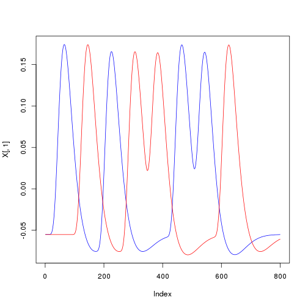 


To generate design matrices, one can use higher-level function such as `generate_paradigm_fixed_SOA`


```r
a <- generate_paradigm_fixed_SOA(ncond = 5, trialpercond = 5, stimduration = 3, 
    SOA = 6, totalduration = 150)
plot_design_matrix(a)
```

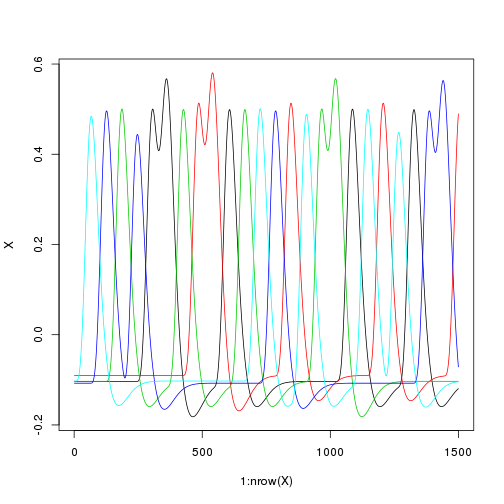 


See also `generate_paradigm_fixed_SOA_adding_silences`, `generate_paradigm_varying_SOA`, `generate_paradigm_varying_SOA_null_events`.

Parameters for the simulations
------------------------------


```r

ncond <- 4  # number of conditions
trialpercond <- 20
stimduration <- 1  # in sec
SOA <- 4  # in sec
(totalduration <- (ncond * trialpercond * SOA) + SOA)
```

```
## [1] 324
```


Contrasts of interest


```r
(listcon <- list(linear = (1:ncond) - mean(1:ncond), firstbeta = c(1, rep(0, 
    ncond - 1))))
```

```
## $linear
## [1] -1.5 -0.5  0.5  1.5
## 
## $firstbeta
## [1] 1 0 0 0
```

The number of simulations for each class of designs:


```r
nsim = 10
```


The simulations will use normal noise


```r
normalnoise <- function(npoints) {
    5 * rnorm(npoints)
}
```


Fixed SOA, no silent trial
--------------------------

Let us generate a paradigm with a fixed SOA...


```r
timing <- generate_paradigm_fixed_SOA(ncond, trialpercond, stimduration, SOA, 
    totalduration)
plot_paradigm(timing)
```

 


... and build its associated design matrix


```r
X <- create_design_matrix(timing, totalduration)
plot_design_matrix(X)
```

 


Now,  for many such designs, we simulate a voxel where the signal increases in a linear fashion with 'condition' (amplitudes=1:5).


```r
o <- simulations(nsim, beta = 1:ncond, listofcontrasts = listcon, normalnoise, 
    generate_paradigm_fixed_SOA, ncond, trialpercond, stimduration, SOA, totalduration)
```


```r
report <- function(outputsim) {
    par(las = 1)
    boxplot(outputsim$estimates, main = "parameter estimates")
    grid()
    boxplot(outputsim$estimatese, main = "standard errors")
    grid()
    for (col in 1:ncol(outputsim$efficiencies)) boxplot(outputsim$efficiencies[, 
        col], main = paste("Efficiency", names(listcon)[col]), horizontal = TRUE)
    grid()
}
```


```r
report(o)
```

   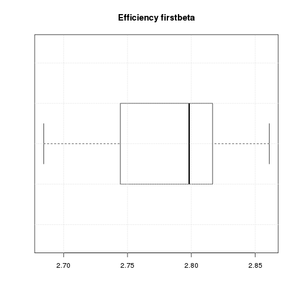 


Designs with jitter between trials
----------------------------------

Now, we jitter the SOA between trials and run a similar simulation.


```r
timing <- generate_paradigm_varying_SOA(ncond, trialpercond, stimduration, SOA, 
    jitter = 4, totalduration)
plot_paradigm(timing)
```

 

```r
X <- create_design_matrix(timing, totalduration)
plot_design_matrix(X)
```

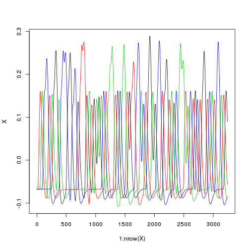 


histogram of SOAs:


```r
hist(diff(timing$onsets))
```

 


```r
o2 <- simulations(nsim, beta = 1:ncond, listofcontrasts = listcon, normalnoise, 
    generate_paradigm_varying_SOA, ncond, trialpercond, stimduration, 4, SOA, 
    totalduration)
```


```r
report(o2)
```

 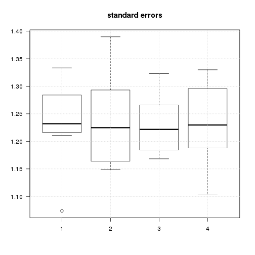  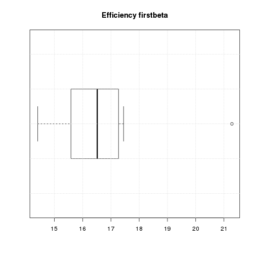 


Design with fixed SOA and 'explicit' NULL events
-------------------------------------------------


```r

timing <- generate_paradigm_fixed_SOA_adding_silences(ncond, trialpercond, stimduration, 
    SOA, totalduration)
plot_paradigm(timing)
```

 

```r
totalduration <- max(timing$onsets) + SOA
X <- create_design_matrix(timing, totalduration)
plot_design_matrix(X)
```

 

```r

o3 <- simulations(nsim, beta = 1:ncond, listofcontrasts = listcon, normalnoise, 
    generate_paradigm_fixed_SOA_adding_silences, ncond, trialpercond, stimduration, 
    SOA, totalduration)

report(o3)
```

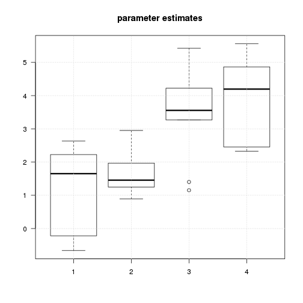   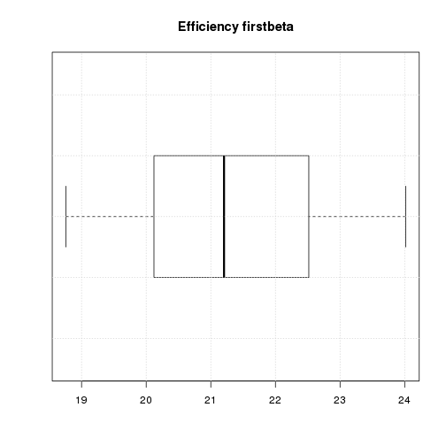 


Designs with varying ISI (a la optseq)
--------------------------------------

Here, the same total amount of silence is inserted as NULL events of varying length between the 'real' trials, introducing jitter.


```r
timing <- generate_paradigm_varying_SOA_null_events(ncond, trialpercond, stimduration, 
    SOA, totalduration)
plot_paradigm(timing)
```

 

```r
totalduration <- max(timing$onsets) + SOA
X <- create_design_matrix(timing, totalduration)
plot_design_matrix(X)
```

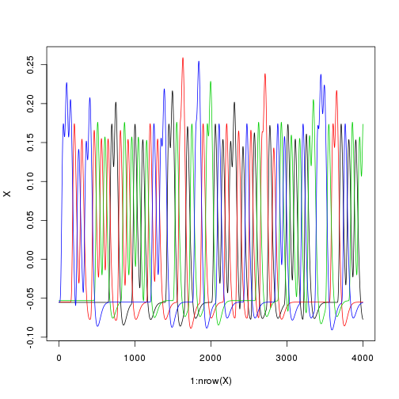 


histogram of SOAs:


```r
hist(diff(timing$onsets))
```

 


```r
o4 <- simulations(nsim, beta = 1:ncond, listofcontrasts = listcon, normalnoise, 
    generate_paradigm_varying_SOA_null_events, ncond, trialpercond, stimduration, 
    SOA, totalduration)

report(o4)
```

   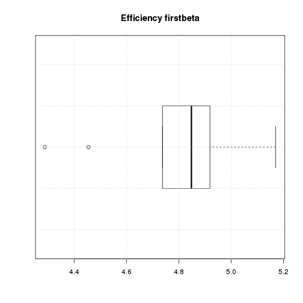 


Importing designs
-----------------

### Fixed SOA with empty trials


```r
timing <- read.table("fMRI_Order_10.csv", sep = ",", col.names = c("onsets", 
    "conditions", "durations"))
timing <- subset(timing, conditions <= 8)
plot_paradigm(timing)
```

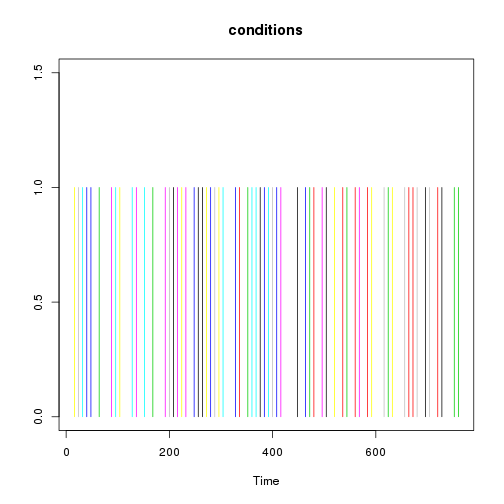 

```r
(totalduration <- max(timing$onsets) + 10)
```

```
## [1] 770
```

```r
table(timing$conditions)
```

```
## 
## 1 2 3 4 5 6 7 8 
## 8 8 8 8 8 8 8 8
```

```r

X <- create_design_matrix(timing, totalduration)
plot_design_matrix(X)
```

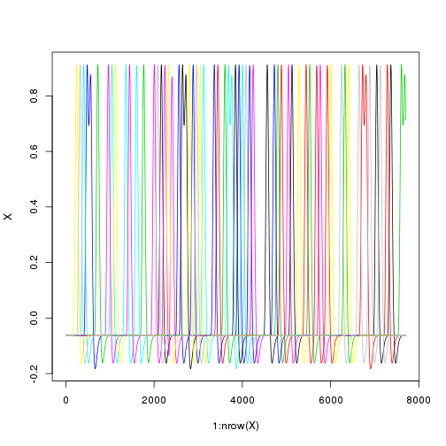 


```r
betas <- c(1:4, 1:4)
singlesimul(X, betas, list(lin = betas - mean(betas)), normalnoise)
```

```
## $estimates
##    XX1    XX2    XX3    XX4    XX5    XX6    XX7    XX8 
## 0.9900 1.5704 3.0654 3.5838 0.3826 1.8910 3.0204 4.4278 
## 
## $estimatese
##    XX1    XX2    XX3    XX4    XX5    XX6    XX7    XX8 
## 0.2747 0.2747 0.2764 0.2754 0.2747 0.2785 0.2760 0.2764 
## 
## $efficiencies
## [1] 40.36
```


```r
for (csvfile in Sys.glob("fMRI_Order*.csv")) {
    timing <- read.table(csvfile, sep = ",", col.names = c("onsets", "conditions", 
        "durations"))
    print("Totalduration")
    print(totalduration <- max(timing$onsets) + 10)
    print(table(timing$conditions))
    timing <- subset(timing, conditions <= 8)
    X <- create_design_matrix(timing, totalduration)
    betas <- c(1:4, 1:4)
    print(singlesimul(X, betas, list(lin = betas - mean(betas)), normalnoise))
}
```

```
## [1] "Totalduration"
## [1] 770
## 
##  1  2  3  4  5  6  7  8  9 10 11 12 
##  8  8  8  8  8  8  8  8  8  8  8  8 
## $estimates
##   XX1   XX2   XX3   XX4   XX5   XX6   XX7   XX8 
## 1.059 2.433 2.786 3.991 1.094 1.504 2.933 3.865 
## 
## $estimatese
##    XX1    XX2    XX3    XX4    XX5    XX6    XX7    XX8 
## 0.2792 0.2792 0.2809 0.2799 0.2791 0.2831 0.2805 0.2809 
## 
## $efficiencies
## [1] 40.36
## 
## [1] "Totalduration"
## [1] 770
## 
##  1  2  3  4  5  6  7  8  9 10 11 12 
##  8  8  8  8  8  8  8  8  8  8  8  8 
## $estimates
##    XX1    XX2    XX3    XX4    XX5    XX6    XX7    XX8 
## 0.7397 1.9075 3.2164 4.0538 1.0589 1.6046 2.6906 4.1041 
## 
## $estimatese
##    XX1    XX2    XX3    XX4    XX5    XX6    XX7    XX8 
## 0.2863 0.2871 0.2848 0.2829 0.2817 0.2840 0.2837 0.2830 
## 
## $efficiencies
## [1] 39.88
## 
## [1] "Totalduration"
## [1] 770
## 
##  1  2  3  4  5  6  7  8  9 10 11 12 
##  8  8  8  8  8  8  8  8  8  8  8  8 
## $estimates
##   XX1   XX2   XX3   XX4   XX5   XX6   XX7   XX8 
## 1.122 2.180 3.214 4.050 1.483 1.970 2.978 4.176 
## 
## $estimatese
##    XX1    XX2    XX3    XX4    XX5    XX6    XX7    XX8 
## 0.2897 0.2801 0.2856 0.2805 0.2811 0.2809 0.2831 0.2800 
## 
## $efficiencies
## [1] 40.01
## 
## [1] "Totalduration"
## [1] 770
## 
##  1  2  3  4  5  6  7  8  9 10 11 12 
##  8  8  8  8  8  8  8  8  8  8  8  8 
## $estimates
##    XX1    XX2    XX3    XX4    XX5    XX6    XX7    XX8 
## 0.7685 2.0021 2.7349 3.6690 1.4484 1.5462 2.7571 3.5862 
## 
## $estimatese
##    XX1    XX2    XX3    XX4    XX5    XX6    XX7    XX8 
## 0.2824 0.2810 0.2799 0.2823 0.2818 0.2825 0.2774 0.2795 
## 
## $efficiencies
## [1] 39.72
## 
## [1] "Totalduration"
## [1] 770
## 
##  1  2  3  4  5  6  7  8  9 10 11 12 
##  8  8  8  8  8  8  8  8  8  8  8  8 
## $estimates
##    XX1    XX2    XX3    XX4    XX5    XX6    XX7    XX8 
## 0.7428 1.9710 2.7065 3.7225 0.2809 1.3304 2.9000 3.7740 
## 
## $estimatese
##    XX1    XX2    XX3    XX4    XX5    XX6    XX7    XX8 
## 0.2772 0.2828 0.2810 0.2783 0.2820 0.2802 0.2782 0.2782 
## 
## $efficiencies
## [1] 40.17
## 
## [1] "Totalduration"
## [1] 770
## 
##  1  2  3  4  5  6  7  8  9 10 11 12 
##  8  8  8  8  8  8  8  8  8  8  8  8 
## $estimates
##    XX1    XX2    XX3    XX4    XX5    XX6    XX7    XX8 
## 1.1760 1.8875 2.8549 3.9420 0.7178 1.9932 2.7312 4.0411 
## 
## $estimatese
##    XX1    XX2    XX3    XX4    XX5    XX6    XX7    XX8 
## 0.2861 0.2876 0.2875 0.2835 0.2847 0.2906 0.2857 0.2876 
## 
## $efficiencies
## [1] 39.55
## 
## [1] "Totalduration"
## [1] 770
## 
##  1  2  3  4  5  6  7  8  9 10 11 12 
##  8  8  8  8  8  8  8  8  8  8  8  8 
## $estimates
##    XX1    XX2    XX3    XX4    XX5    XX6    XX7    XX8 
## 1.1325 2.0589 3.1969 4.4230 0.9812 2.0013 2.9636 4.0216 
## 
## $estimatese
##    XX1    XX2    XX3    XX4    XX5    XX6    XX7    XX8 
## 0.2805 0.2777 0.2801 0.2793 0.2799 0.2804 0.2806 0.2782 
## 
## $efficiencies
## [1] 39.77
## 
## [1] "Totalduration"
## [1] 770
## 
##  1  2  3  4  5  6  7  8  9 10 11 12 
##  8  8  8  8  8  8  8  8  8  8  8  8 
## $estimates
##    XX1    XX2    XX3    XX4    XX5    XX6    XX7    XX8 
## 0.8327 2.0224 3.0098 4.3533 0.9019 2.8370 3.5492 3.4683 
## 
## $estimatese
##    XX1    XX2    XX3    XX4    XX5    XX6    XX7    XX8 
## 0.2772 0.2789 0.2762 0.2823 0.2854 0.2785 0.2833 0.2809 
## 
## $efficiencies
## [1] 38.74
## 
## [1] "Totalduration"
## [1] 770
## 
##  1  2  3  4  5  6  7  8  9 10 11 12 
##  8  8  8  8  8  8  8  8  8  8  8  8 
## $estimates
##    XX1    XX2    XX3    XX4    XX5    XX6    XX7    XX8 
## 0.6310 1.6084 2.5189 4.0480 0.8474 2.0007 3.0838 4.1608 
## 
## $estimatese
##    XX1    XX2    XX3    XX4    XX5    XX6    XX7    XX8 
## 0.2781 0.2799 0.2759 0.2791 0.2807 0.2798 0.2783 0.2827 
## 
## $efficiencies
## [1] 39.61
## 
## [1] "Totalduration"
## [1] 770
## 
##  1  2  3  4  5  6  7  8  9 10 11 12 
##  8  8  8  8  8  8  8  8  8  8  8  8 
## $estimates
##   XX1   XX2   XX3   XX4   XX5   XX6   XX7   XX8 
## 1.049 2.305 2.666 3.976 1.183 2.119 3.388 4.124 
## 
## $estimatese
##    XX1    XX2    XX3    XX4    XX5    XX6    XX7    XX8 
## 0.2828 0.2820 0.2811 0.2857 0.2798 0.2820 0.2778 0.2780 
## 
## $efficiencies
## [1] 38.32
```

  
### sequences created by optseq  


```r
timing <- read.table("optseq/simcomp-001.par", col.names = c("onsets", "conditions", 
    "durations", "weight", "condn"))
totalduration <- max(timing$onsets) + 10
print("Totalduration")
```

```
## [1] "Totalduration"
```

```r
print(totalduration <- max(timing$onsets) + 10)
```

```
## [1] 775
```

```r
timing <- subset(timing, conditions != 0)
print(table(timing$conditions))
```

```
## 
##  1  2  3  4  5  6  7  8  9 10 
##  8  8  8  8  8  8  8  8  8  8
```

```r
hist(diff(timing$onsets))
```

 

```r
plot_paradigm(timing)
```

 

```r

X <- create_design_matrix(timing, totalduration)
plot_design_matrix(X)
```

 


```r
for (csvfile in Sys.glob("optseq/simcomp*.par")) {
    timing <- read.table(csvfile, col.names = c("onsets", "conditions", "durations", 
        "weight", "condn"))
    totalduration <- max(timing$onsets) + 10
    print("Totalduration")
    print(totalduration <- max(timing$onsets) + 10)
    timing <- subset(timing, conditions != 0)
    print(table(timing$conditions))
    hist(diff(timing$onsets))
    X <- create_design_matrix(timing, totalduration)
    betas <- c(1:4, 1:4, 0, 0)
    print(singlesimul(X, betas, list(lin = betas - mean(betas)), normalnoise))
}
```

```
## [1] "Totalduration"
## [1] 775
## 
##  1  2  3  4  5  6  7  8  9 10 
##  8  8  8  8  8  8  8  8  8  8
```

 

```
## $estimates
##     XX1     XX2     XX3     XX4     XX5     XX6     XX7     XX8     XX9 
##  0.5655  1.8904  2.9018  4.2971  0.6127  1.7076  2.4811  3.5811 -0.3510 
##    XX10 
##  0.1159 
## 
## $estimatese
##    XX1    XX2    XX3    XX4    XX5    XX6    XX7    XX8    XX9   XX10 
## 0.2997 0.3013 0.2874 0.2900 0.2967 0.3047 0.2968 0.2956 0.2991 0.2925 
## 
## $efficiencies
## [1] 20
## 
## [1] "Totalduration"
## [1] 772
## 
##  1  2  3  4  5  6  7  8  9 10 
##  8  8  8  8  8  8  8  8  8  8
```

 

```
## $estimates
##     XX1     XX2     XX3     XX4     XX5     XX6     XX7     XX8     XX9 
##  0.9802  1.6237  2.7041  4.0638  1.1653  1.9509  3.0472  4.1155  0.1260 
##    XX10 
## -0.2903 
## 
## $estimatese
##    XX1    XX2    XX3    XX4    XX5    XX6    XX7    XX8    XX9   XX10 
## 0.2785 0.2979 0.2897 0.2838 0.2766 0.2836 0.2861 0.2895 0.2971 0.2853 
## 
## $efficiencies
## [1] 20.59
## 
## [1] "Totalduration"
## [1] 767.5
## 
##  1  2  3  4  5  6  7  8  9 10 
##  8  8  8  8  8  8  8  8  8  8
```

 

```
## $estimates
##      XX1      XX2      XX3      XX4      XX5      XX6      XX7      XX8 
##  0.95491  2.20179  3.15058  4.27536  0.79818  1.79835  2.92407  4.18745 
##      XX9     XX10 
##  0.19873 -0.03798 
## 
## $estimatese
##    XX1    XX2    XX3    XX4    XX5    XX6    XX7    XX8    XX9   XX10 
## 0.2986 0.3024 0.3078 0.3085 0.3002 0.3107 0.2934 0.3066 0.2991 0.3009 
## 
## $efficiencies
## [1] 18.53
## 
## [1] "Totalduration"
## [1] 777
## 
##  1  2  3  4  5  6  7  8  9 10 
##  8  8  8  8  8  8  8  8  8  8
```

 

```
## $estimates
##       XX1       XX2       XX3       XX4       XX5       XX6       XX7 
##  1.157190  2.121544  3.427362  4.102441  1.108733  1.946142  2.865447 
##       XX8       XX9      XX10 
##  4.235817 -0.003329  0.200168 
## 
## $estimatese
##    XX1    XX2    XX3    XX4    XX5    XX6    XX7    XX8    XX9   XX10 
## 0.2865 0.2923 0.2853 0.2875 0.2718 0.2903 0.2936 0.2779 0.2652 0.2826 
## 
## $efficiencies
## [1] 20.39
## 
## [1] "Totalduration"
## [1] 777.5
## 
##  1  2  3  4  5  6  7  8  9 10 
##  8  8  8  8  8  8  8  8  8  8
```

 

```
## $estimates
##    XX1    XX2    XX3    XX4    XX5    XX6    XX7    XX8    XX9   XX10 
## 0.9079 1.9232 2.7854 3.9212 1.0241 2.3146 3.0076 4.1313 0.4740 0.2679 
## 
## $estimatese
##    XX1    XX2    XX3    XX4    XX5    XX6    XX7    XX8    XX9   XX10 
## 0.2916 0.2898 0.2790 0.2877 0.2948 0.2908 0.2964 0.2975 0.2871 0.2918 
## 
## $efficiencies
## [1] 20.49
## 
## [1] "Totalduration"
## [1] 775.5
## 
##  1  2  3  4  5  6  7  8  9 10 
##  8  8  8  8  8  8  8  8  8  8
```

 

```
## $estimates
##     XX1     XX2     XX3     XX4     XX5     XX6     XX7     XX8     XX9 
##  0.5375  2.0141  3.3119  4.2056  0.8559  1.7671  2.7261  3.9694  0.2141 
##    XX10 
## -0.1459 
## 
## $estimatese
##    XX1    XX2    XX3    XX4    XX5    XX6    XX7    XX8    XX9   XX10 
## 0.2870 0.2831 0.2814 0.2801 0.2864 0.2878 0.2905 0.2944 0.2875 0.2770 
## 
## $efficiencies
## [1] 19.68
## 
## [1] "Totalduration"
## [1] 776
## 
##  1  2  3  4  5  6  7  8  9 10 
##  8  8  8  8  8  8  8  8  8  8
```

 

```
## $estimates
##     XX1     XX2     XX3     XX4     XX5     XX6     XX7     XX8     XX9 
## 0.71318 2.07913 3.09466 4.04862 1.31959 2.17483 3.21328 4.41804 0.24369 
##    XX10 
## 0.01017 
## 
## $estimatese
##    XX1    XX2    XX3    XX4    XX5    XX6    XX7    XX8    XX9   XX10 
## 0.2878 0.2860 0.2951 0.2951 0.2908 0.2871 0.2897 0.2977 0.2834 0.2919 
## 
## $efficiencies
## [1] 19.9
## 
## [1] "Totalduration"
## [1] 763
## 
##  1  2  3  4  5  6  7  8  9 10 
##  8  8  8  8  8  8  8  8  8  8
```

 

```
## $estimates
##     XX1     XX2     XX3     XX4     XX5     XX6     XX7     XX8     XX9 
## 1.15225 2.11857 3.19503 3.90979 1.23524 1.79912 3.22370 4.31559 0.04904 
##    XX10 
## 0.03166 
## 
## $estimatese
##    XX1    XX2    XX3    XX4    XX5    XX6    XX7    XX8    XX9   XX10 
## 0.3031 0.3030 0.3045 0.3036 0.3037 0.2968 0.2967 0.3069 0.2968 0.2942 
## 
## $efficiencies
## [1] 19.74
## 
## [1] "Totalduration"
## [1] 776.5
## 
##  1  2  3  4  5  6  7  8  9 10 
##  8  8  8  8  8  8  8  8  8  8
```

 

```
## $estimates
##     XX1     XX2     XX3     XX4     XX5     XX6     XX7     XX8     XX9 
##  1.1665  2.1140  3.2115  3.9795  1.2648  2.0827  2.9956  4.0750 -0.2077 
##    XX10 
##  0.1455 
## 
## $estimatese
##    XX1    XX2    XX3    XX4    XX5    XX6    XX7    XX8    XX9   XX10 
## 0.2888 0.2865 0.3099 0.2913 0.2856 0.2989 0.2929 0.3015 0.2884 0.2866 
## 
## $efficiencies
## [1] 19.23
## 
## [1] "Totalduration"
## [1] 776.5
## 
##  1  2  3  4  5  6  7  8  9 10 
##  8  8  8  8  8  8  8  8  8  8
```

 

```
## $estimates
##    XX1    XX2    XX3    XX4    XX5    XX6    XX7    XX8    XX9   XX10 
## 1.1776 2.2891 3.2186 4.1015 1.4688 1.9758 3.4472 4.2228 0.2708 0.3196 
## 
## $estimatese
##    XX1    XX2    XX3    XX4    XX5    XX6    XX7    XX8    XX9   XX10 
## 0.2847 0.2977 0.2981 0.2990 0.2971 0.2995 0.3025 0.2980 0.2914 0.2972 
## 
## $efficiencies
## [1] 19.25
```

  

