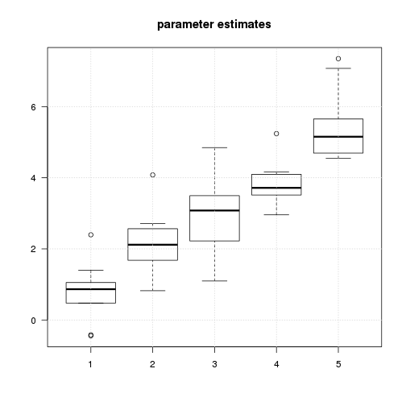
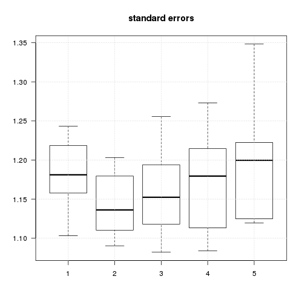
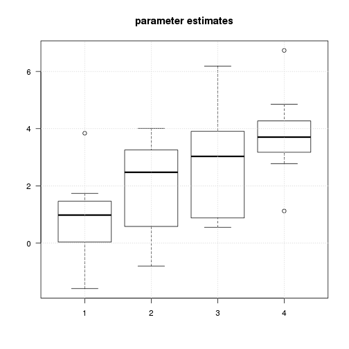
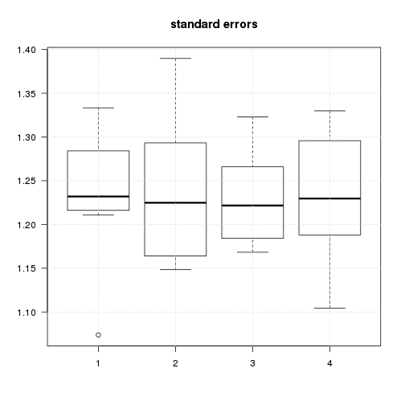
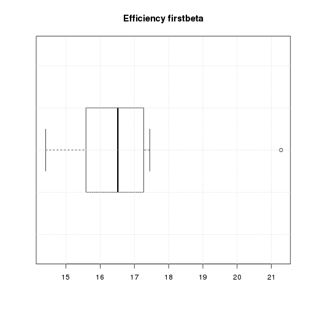

Tests of the efficiency of various fMRI designs
===============================================

Time-stamp: <2013-01-08 17:06 christophe@pallier.org>

Note: This document is generated from the source file [simul6.Rmd](simul6.Rmd), a Rmarkdown document that can be processed with knitr and edited with rstudio.

We present some simulations comparing the power of designs with fixed ISI to designs with varying ISI. We are interested in how precise are the estimates of the parameters associated to each condition.


```
## Loading required package: MASS
```


```r
normalnoise <- function(npoints) {
    5 * rnorm(npoints)
}
```


Importing designs
-----------------

### Fixed SOA with empty trials

We load one schedule:


```r
timing <- read.table("fMRI_Order_10.csv", sep = ",", col.names = c("onsets", 
    "conditions", "durations"))
timing <- subset(timing, conditions <= 10)
plot_paradigm(timing)
```

 

```r
(totalduration <- max(timing$onsets) + 10)
```

```
## [1] 770
```

```r
table(timing$conditions)
```

```
## 
##  1  2  3  4  5  6  7  8  9 10 
##  8  8  8  8  8  8  8  8  8  8 
```

```r

X <- create_design_matrix(timing, totalduration)
plot_design_matrix(X)
```

 


```r
betas <- c(1:5, -(1:5))
singlesimul(X, betas, list(lin = betas - mean(betas)), normalnoise)
```

```
## $estimates
##     XX1     XX2     XX3     XX4     XX5     XX6     XX7     XX8     XX9 
##  0.9814  1.9158  2.5133  3.5144  4.3238 -1.0531 -2.2418 -3.2063 -3.9116 
##    XX10 
## -5.3874 
## 
## $estimatese
##    XX1    XX2    XX3    XX4    XX5    XX6    XX7    XX8    XX9   XX10 
## 0.3039 0.3030 0.3028 0.3028 0.3006 0.3058 0.3037 0.3040 0.3041 0.3038 
## 
## $efficiencies
## [1] 3.597
## 
```


Now, we load all schedules and report, for each, the estimates, their standard errors, and the theoretical efficiency of the contrast c(1:5, -(1:5)).


```r
for (csvfile in Sys.glob("fMRI_Order*.csv")) {
    timing <- read.table(csvfile, sep = ",", col.names = c("onsets", "conditions", 
        "durations"))
    print("Totalduration")
    print(totalduration <- max(timing$onsets) + 10)
    print(table(timing$conditions))
    timing <- subset(timing, conditions <= 10)
    X <- create_design_matrix(timing, totalduration)
    betas <- c(1:5, -(1:5))
    cons <- list(lin = betas - mean(betas), beta1 = c(1, rep(0, ncol(X) - 1)))
    o <- singlesimul(X, betas, cons, normalnoise)
    print("Standard errors of estimates:")
    print(summary(as.numeric(o$estimatese)))
    print("Efficiency of linear contrast:")
    print("Efficiency of contrasts:")
    for (i in 1:length(cons)) {
        print(cons[i])
        print(o$efficiencies[i])
    }
}
```

```
## [1] "Totalduration"
## [1] 770
## 
##  1  2  3  4  5  6  7  8  9 10 11 12 
##  8  8  8  8  8  8  8  8  8  8  8  8 
## [1] "Standard errors of estimates:"
##    Min. 1st Qu.  Median    Mean 3rd Qu.    Max. 
##   0.297   0.300   0.300   0.300   0.301   0.302 
## [1] "Efficiency of linear contrast:"
## [1] "Efficiency of contrasts:"
## $lin
##  [1]  1  2  3  4  5 -1 -2 -3 -4 -5
## 
## [1] 3.597
## $beta1
##  [1] 1 0 0 0 0 0 0 0 0 0
## 
## [1] 272.2
## [1] "Totalduration"
## [1] 770
## 
##  1  2  3  4  5  6  7  8  9 10 11 12 
##  8  8  8  8  8  8  8  8  8  8  8  8 
## [1] "Standard errors of estimates:"
##    Min. 1st Qu.  Median    Mean 3rd Qu.    Max. 
##   0.295   0.298   0.299   0.299   0.299   0.303 
## [1] "Efficiency of linear contrast:"
## [1] "Efficiency of contrasts:"
## $lin
##  [1]  1  2  3  4  5 -1 -2 -3 -4 -5
## 
## [1] 3.575
## $beta1
##  [1] 1 0 0 0 0 0 0 0 0 0
## 
## [1] 267.9
## [1] "Totalduration"
## [1] 770
## 
##  1  2  3  4  5  6  7  8  9 10 11 12 
##  8  8  8  8  8  8  8  8  8  8  8  8 
## [1] "Standard errors of estimates:"
##    Min. 1st Qu.  Median    Mean 3rd Qu.    Max. 
##   0.304   0.305   0.306   0.307   0.308   0.313 
## [1] "Efficiency of linear contrast:"
## [1] "Efficiency of contrasts:"
## $lin
##  [1]  1  2  3  4  5 -1 -2 -3 -4 -5
## 
## [1] 3.625
## $beta1
##  [1] 1 0 0 0 0 0 0 0 0 0
## 
## [1] 260.1
## [1] "Totalduration"
## [1] 770
## 
##  1  2  3  4  5  6  7  8  9 10 11 12 
##  8  8  8  8  8  8  8  8  8  8  8  8 
## [1] "Standard errors of estimates:"
##    Min. 1st Qu.  Median    Mean 3rd Qu.    Max. 
##   0.301   0.303   0.304   0.304   0.305   0.306 
## [1] "Efficiency of linear contrast:"
## [1] "Efficiency of contrasts:"
## $lin
##  [1]  1  2  3  4  5 -1 -2 -3 -4 -5
## 
## [1] 3.576
## $beta1
##  [1] 1 0 0 0 0 0 0 0 0 0
## 
## [1] 269.8
## [1] "Totalduration"
## [1] 770
## 
##  1  2  3  4  5  6  7  8  9 10 11 12 
##  8  8  8  8  8  8  8  8  8  8  8  8 
## [1] "Standard errors of estimates:"
##    Min. 1st Qu.  Median    Mean 3rd Qu.    Max. 
##   0.305   0.307   0.309   0.308   0.310   0.310 
## [1] "Efficiency of linear contrast:"
## [1] "Efficiency of contrasts:"
## $lin
##  [1]  1  2  3  4  5 -1 -2 -3 -4 -5
## 
## [1] 3.469
## $beta1
##  [1] 1 0 0 0 0 0 0 0 0 0
## 
## [1] 270
## [1] "Totalduration"
## [1] 770
## 
##  1  2  3  4  5  6  7  8  9 10 11 12 
##  8  8  8  8  8  8  8  8  8  8  8  8 
## [1] "Standard errors of estimates:"
##    Min. 1st Qu.  Median    Mean 3rd Qu.    Max. 
##   0.296   0.298   0.300   0.300   0.301   0.305 
## [1] "Efficiency of linear contrast:"
## [1] "Efficiency of contrasts:"
## $lin
##  [1]  1  2  3  4  5 -1 -2 -3 -4 -5
## 
## [1] 3.609
## $beta1
##  [1] 1 0 0 0 0 0 0 0 0 0
## 
## [1] 272.8
## [1] "Totalduration"
## [1] 770
## 
##  1  2  3  4  5  6  7  8  9 10 11 12 
##  8  8  8  8  8  8  8  8  8  8  8  8 
## [1] "Standard errors of estimates:"
##    Min. 1st Qu.  Median    Mean 3rd Qu.    Max. 
##   0.298   0.301   0.303   0.302   0.304   0.304 
## [1] "Efficiency of linear contrast:"
## [1] "Efficiency of contrasts:"
## $lin
##  [1]  1  2  3  4  5 -1 -2 -3 -4 -5
## 
## [1] 3.661
## $beta1
##  [1] 1 0 0 0 0 0 0 0 0 0
## 
## [1] 274
## [1] "Totalduration"
## [1] 770
## 
##  1  2  3  4  5  6  7  8  9 10 11 12 
##  8  8  8  8  8  8  8  8  8  8  8  8 
## [1] "Standard errors of estimates:"
##    Min. 1st Qu.  Median    Mean 3rd Qu.    Max. 
##   0.300   0.302   0.304   0.304   0.307   0.310 
## [1] "Efficiency of linear contrast:"
## [1] "Efficiency of contrasts:"
## $lin
##  [1]  1  2  3  4  5 -1 -2 -3 -4 -5
## 
## [1] 3.634
## $beta1
##  [1] 1 0 0 0 0 0 0 0 0 0
## 
## [1] 277.1
## [1] "Totalduration"
## [1] 770
## 
##  1  2  3  4  5  6  7  8  9 10 11 12 
##  8  8  8  8  8  8  8  8  8  8  8  8 
## [1] "Standard errors of estimates:"
##    Min. 1st Qu.  Median    Mean 3rd Qu.    Max. 
##   0.299   0.303   0.304   0.304   0.305   0.308 
## [1] "Efficiency of linear contrast:"
## [1] "Efficiency of contrasts:"
## $lin
##  [1]  1  2  3  4  5 -1 -2 -3 -4 -5
## 
## [1] 3.574
## $beta1
##  [1] 1 0 0 0 0 0 0 0 0 0
## 
## [1] 273.1
## [1] "Totalduration"
## [1] 770
## 
##  1  2  3  4  5  6  7  8  9 10 11 12 
##  8  8  8  8  8  8  8  8  8  8  8  8 
## [1] "Standard errors of estimates:"
##    Min. 1st Qu.  Median    Mean 3rd Qu.    Max. 
##   0.298   0.301   0.304   0.303   0.304   0.305 
## [1] "Efficiency of linear contrast:"
## [1] "Efficiency of contrasts:"
## $lin
##  [1]  1  2  3  4  5 -1 -2 -3 -4 -5
## 
## [1] 3.639
## $beta1
##  [1] 1 0 0 0 0 0 0 0 0 0
## 
## [1] 270
```

  
### sequences created by optseq  


```r
timing <- read.table("optseq/simcomp-001.par", col.names = c("onsets", "conditions", 
    "durations", "weight", "condn"))
totalduration <- max(timing$onsets) + 10
timing <- subset(timing, conditions != 0)
print(table(timing$conditions))
```

```
## 
##  1  2  3  4  5  6  7  8  9 10 
##  8  8  8  8  8  8  8  8  8  8 
```

```r
hist(diff(timing$onsets))
```

 

```r
plot_paradigm(timing)
```

 

```r

X <- create_design_matrix(timing, totalduration)
plot_design_matrix(X)
```

 


```r
for (csvfile in Sys.glob("optseq/simcomp*.par")) {
    timing <- read.table(csvfile, col.names = c("onsets", "conditions", "durations", 
        "weight", "condn"))
    totalduration <- max(timing$onsets) + 10
    timing <- subset(timing, conditions != 0)
    print(table(timing$conditions))
    hist(diff(timing$onsets))
    X <- create_design_matrix(timing, totalduration)
    cons <- list(lin = betas - mean(betas), beta1 = c(1, rep(0, ncol(X) - 1)))
    o <- singlesimul(X, betas, cons, normalnoise)
    print("Standard errors of estimates:")
    print(summary(as.numeric(o$estimatese)))
    print("Efficiency of contrasts:")
    for (i in 1:length(cons)) {
        print(cons[i])
        print(o$efficiencies[i])
    }
}
```

```
## 
##  1  2  3  4  5  6  7  8  9 10 
##  8  8  8  8  8  8  8  8  8  8 
```

```
## [1] "Standard errors of estimates:"
##    Min. 1st Qu.  Median    Mean 3rd Qu.    Max. 
##   0.285   0.290   0.294   0.293   0.297   0.302 
## [1] "Efficiency of contrasts:"
## $lin
##  [1]  1  2  3  4  5 -1 -2 -3 -4 -5
## 
## [1] 3.538
## $beta1
##  [1] 1 0 0 0 0 0 0 0 0 0
## 
## [1] 284.8
## 
##  1  2  3  4  5  6  7  8  9 10 
##  8  8  8  8  8  8  8  8  8  8 
```

 

```
## [1] "Standard errors of estimates:"
##    Min. 1st Qu.  Median    Mean 3rd Qu.    Max. 
##   0.280   0.287   0.289   0.290   0.293   0.302 
## [1] "Efficiency of contrasts:"
## $lin
##  [1]  1  2  3  4  5 -1 -2 -3 -4 -5
## 
## [1] 3.651
## $beta1
##  [1] 1 0 0 0 0 0 0 0 0 0
## 
## [1] 314.4
## 
##  1  2  3  4  5  6  7  8  9 10 
##  8  8  8  8  8  8  8  8  8  8 
```

 

```
## [1] "Standard errors of estimates:"
##    Min. 1st Qu.  Median    Mean 3rd Qu.    Max. 
##   0.287   0.293   0.295   0.297   0.301   0.304 
## [1] "Efficiency of contrasts:"
## $lin
##  [1]  1  2  3  4  5 -1 -2 -3 -4 -5
## 
## [1] 3.486
## $beta1
##  [1] 1 0 0 0 0 0 0 0 0 0
## 
## [1] 289
## 
##  1  2  3  4  5  6  7  8  9 10 
##  8  8  8  8  8  8  8  8  8  8 
```

 

```
## [1] "Standard errors of estimates:"
##    Min. 1st Qu.  Median    Mean 3rd Qu.    Max. 
##   0.262   0.276   0.283   0.280   0.286   0.290 
## [1] "Efficiency of contrasts:"
## $lin
##  [1]  1  2  3  4  5 -1 -2 -3 -4 -5
## 
## [1] 3.666
## $beta1
##  [1] 1 0 0 0 0 0 0 0 0 0
## 
## [1] 306.5
## 
##  1  2  3  4  5  6  7  8  9 10 
##  8  8  8  8  8  8  8  8  8  8 
```

 

```
## [1] "Standard errors of estimates:"
##    Min. 1st Qu.  Median    Mean 3rd Qu.    Max. 
##   0.282   0.291   0.294   0.294   0.297   0.301 
## [1] "Efficiency of contrasts:"
## $lin
##  [1]  1  2  3  4  5 -1 -2 -3 -4 -5
## 
## [1] 3.744
## $beta1
##  [1] 1 0 0 0 0 0 0 0 0 0
## 
## [1] 292.3
## 
##  1  2  3  4  5  6  7  8  9 10 
##  8  8  8  8  8  8  8  8  8  8 
```

 

```
## [1] "Standard errors of estimates:"
##    Min. 1st Qu.  Median    Mean 3rd Qu.    Max. 
##   0.280   0.285   0.290   0.289   0.291   0.298 
## [1] "Efficiency of contrasts:"
## $lin
##  [1]  1  2  3  4  5 -1 -2 -3 -4 -5
## 
## [1] 3.565
## $beta1
##  [1] 1 0 0 0 0 0 0 0 0 0
## 
## [1] 302.4
## 
##  1  2  3  4  5  6  7  8  9 10 
##  8  8  8  8  8  8  8  8  8  8 
```

 

```
## [1] "Standard errors of estimates:"
##    Min. 1st Qu.  Median    Mean 3rd Qu.    Max. 
##   0.284   0.288   0.291   0.291   0.295   0.298 
## [1] "Efficiency of contrasts:"
## $lin
##  [1]  1  2  3  4  5 -1 -2 -3 -4 -5
## 
## [1] 3.785
## $beta1
##  [1] 1 0 0 0 0 0 0 0 0 0
## 
## [1] 301.5
## 
##  1  2  3  4  5  6  7  8  9 10 
##  8  8  8  8  8  8  8  8  8  8 
```

 

```
## [1] "Standard errors of estimates:"
##    Min. 1st Qu.  Median    Mean 3rd Qu.    Max. 
##   0.294   0.297   0.303   0.301   0.304   0.307 
## [1] "Efficiency of contrasts:"
## $lin
##  [1]  1  2  3  4  5 -1 -2 -3 -4 -5
## 
## [1] 3.366
## $beta1
##  [1] 1 0 0 0 0 0 0 0 0 0
## 
## [1] 272.7
## 
##  1  2  3  4  5  6  7  8  9 10 
##  8  8  8  8  8  8  8  8  8  8 
```

 

```
## [1] "Standard errors of estimates:"
##    Min. 1st Qu.  Median    Mean 3rd Qu.    Max. 
##   0.281   0.283   0.286   0.289   0.293   0.305 
## [1] "Efficiency of contrasts:"
## $lin
##  [1]  1  2  3  4  5 -1 -2 -3 -4 -5
## 
## [1] 3.707
## $beta1
##  [1] 1 0 0 0 0 0 0 0 0 0
## 
## [1] 304.5
## 
##  1  2  3  4  5  6  7  8  9 10 
##  8  8  8  8  8  8  8  8  8  8 
```

 

```
## [1] "Standard errors of estimates:"
##    Min. 1st Qu.  Median    Mean 3rd Qu.    Max. 
##   0.277   0.289   0.290   0.288   0.291   0.294 
## [1] "Efficiency of contrasts:"
## $lin
##  [1]  1  2  3  4  5 -1 -2 -3 -4 -5
## 
## [1] 3.384
## $beta1
##  [1] 1 0 0 0 0 0 0 0 0 0
## 
## [1] 317.3
```

 

  
  
Random sequences with no silence
--------------------------------


```r
ncond <- 10
trialspercond <- 8
stimduration <- 6
SOA <- 8
totalduration <- ncond * trialspercond * SOA + 10

for (i in 1:10) {
    timing <- generate_paradigm_fixed_SOA(ncond, trialspercond, stimduration, 
        SOA, totalduration)
    X <- create_design_matrix(timing, totalduration)
    cons <- list(lin = betas - mean(betas), beta1 = c(1, rep(0, ncol(X) - 1)))
    o <- singlesimul(X, betas, cons, normalnoise)
    print("Standard errors of estimates:")
    print(summary(as.numeric(o$estimatese)))
    print("Efficiency of contrasts:")
    for (i in 1:length(cons)) {
        print(cons[i])
        print(o$efficiencies[i])
    }
}
```

```
## [1] "Standard errors of estimates:"
##    Min. 1st Qu.  Median    Mean 3rd Qu.    Max. 
##   0.545   0.549   0.551   0.551   0.552   0.557 
## [1] "Efficiency of contrasts:"
## $lin
##  [1]  1  2  3  4  5 -1 -2 -3 -4 -5
## 
## [1] 3.529
## $beta1
##  [1] 1 0 0 0 0 0 0 0 0 0
## 
## [1] 81.75
## [1] "Standard errors of estimates:"
##    Min. 1st Qu.  Median    Mean 3rd Qu.    Max. 
##   0.536   0.539   0.540   0.540   0.542   0.545 
## [1] "Efficiency of contrasts:"
## $lin
##  [1]  1  2  3  4  5 -1 -2 -3 -4 -5
## 
## [1] 3.595
## $beta1
##  [1] 1 0 0 0 0 0 0 0 0 0
## 
## [1] 84.96
## [1] "Standard errors of estimates:"
##    Min. 1st Qu.  Median    Mean 3rd Qu.    Max. 
##   0.532   0.535   0.537   0.537   0.538   0.542 
## [1] "Efficiency of contrasts:"
## $lin
##  [1]  1  2  3  4  5 -1 -2 -3 -4 -5
## 
## [1] 3.551
## $beta1
##  [1] 1 0 0 0 0 0 0 0 0 0
## 
## [1] 85.12
## [1] "Standard errors of estimates:"
##    Min. 1st Qu.  Median    Mean 3rd Qu.    Max. 
##   0.545   0.546   0.547   0.547   0.548   0.552 
## [1] "Efficiency of contrasts:"
## $lin
##  [1]  1  2  3  4  5 -1 -2 -3 -4 -5
## 
## [1] 3.735
## $beta1
##  [1] 1 0 0 0 0 0 0 0 0 0
## 
## [1] 83.55
## [1] "Standard errors of estimates:"
##    Min. 1st Qu.  Median    Mean 3rd Qu.    Max. 
##   0.536   0.542   0.543   0.543   0.544   0.546 
## [1] "Efficiency of contrasts:"
## $lin
##  [1]  1  2  3  4  5 -1 -2 -3 -4 -5
## 
## [1] 3.659
## $beta1
##  [1] 1 0 0 0 0 0 0 0 0 0
## 
## [1] 82.94
## [1] "Standard errors of estimates:"
##    Min. 1st Qu.  Median    Mean 3rd Qu.    Max. 
##   0.548   0.551   0.552   0.552   0.553   0.557 
## [1] "Efficiency of contrasts:"
## $lin
##  [1]  1  2  3  4  5 -1 -2 -3 -4 -5
## 
## [1] 3.544
## $beta1
##  [1] 1 0 0 0 0 0 0 0 0 0
## 
## [1] 83.45
## [1] "Standard errors of estimates:"
##    Min. 1st Qu.  Median    Mean 3rd Qu.    Max. 
##   0.539   0.543   0.544   0.544   0.545   0.548 
## [1] "Efficiency of contrasts:"
## $lin
##  [1]  1  2  3  4  5 -1 -2 -3 -4 -5
## 
## [1] 3.551
## $beta1
##  [1] 1 0 0 0 0 0 0 0 0 0
## 
## [1] 84.95
## [1] "Standard errors of estimates:"
##    Min. 1st Qu.  Median    Mean 3rd Qu.    Max. 
##   0.544   0.547   0.548   0.548   0.549   0.553 
## [1] "Efficiency of contrasts:"
## $lin
##  [1]  1  2  3  4  5 -1 -2 -3 -4 -5
## 
## [1] 3.617
## $beta1
##  [1] 1 0 0 0 0 0 0 0 0 0
## 
## [1] 84.68
## [1] "Standard errors of estimates:"
##    Min. 1st Qu.  Median    Mean 3rd Qu.    Max. 
##   0.539   0.541   0.542   0.542   0.543   0.548 
## [1] "Efficiency of contrasts:"
## $lin
##  [1]  1  2  3  4  5 -1 -2 -3 -4 -5
## 
## [1] 3.606
## $beta1
##  [1] 1 0 0 0 0 0 0 0 0 0
## 
## [1] 82.12
## [1] "Standard errors of estimates:"
##    Min. 1st Qu.  Median    Mean 3rd Qu.    Max. 
##   0.548   0.552   0.552   0.552   0.553   0.554 
## [1] "Efficiency of contrasts:"
## $lin
##  [1]  1  2  3  4  5 -1 -2 -3 -4 -5
## 
## [1] 3.688
## $beta1
##  [1] 1 0 0 0 0 0 0 0 0 0
## 
## [1] 83.48
```


