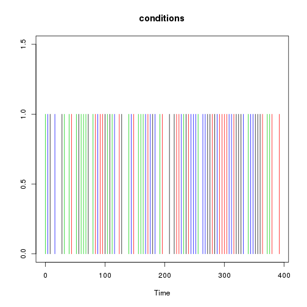
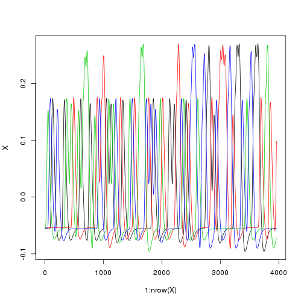
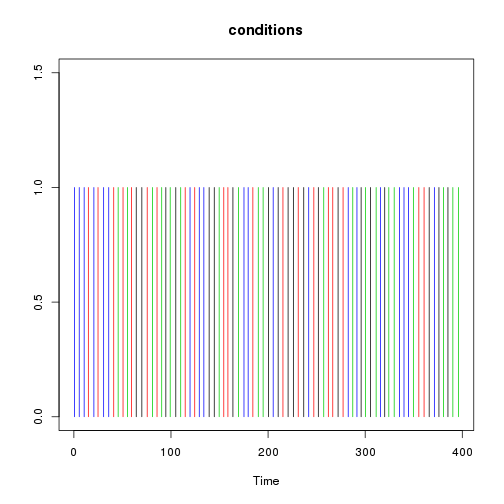
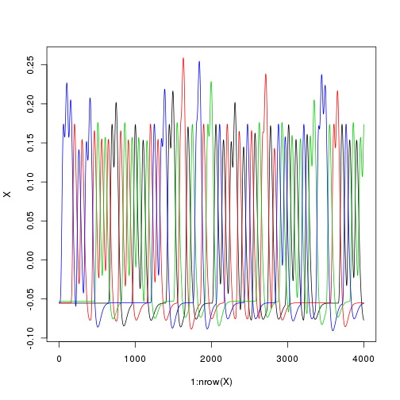
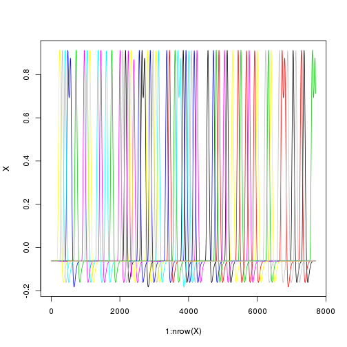
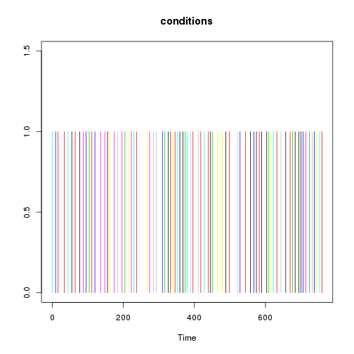
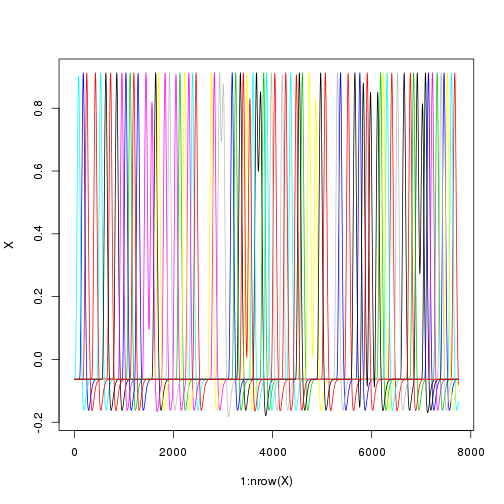

Tests of the efficiency of various fMRI designs
===============================================

Time-stamp: <2013-01-08 17:06 christophe@pallier.org>

Note: This document is generated from the source file [simul_syntcomp.Rmd](simul_syntcomp.Rmd), a Rmarkdown document that can be processed with knitr and edited with rstudio.

We present some simulations comparing the power of designs with fixed ISI to designs with varying ISI. We are interested in how precise are the estimates of the parameters associated to each condition.


```
## Loading required package: MASS
```


```r
generate_paradigm_fixed_SOA <- function(ncond, trialpercond, stimduration, SOA, 
    totalduration) # ncond is the number of different experimental conditions, stimduration,
# SOA and totalduration must be expressed in seconds
{
    ntrials <- ncond * trialpercond
    conditions <- sample(rep(1:ncond, trialpercond))
    onsets <- (1:ntrials - 1) * SOA
    durations <- rep(stimduration, ntrials)
    timing <- data.frame(onsets, conditions, durations)
    timing
}

generate_paradigm_fixed_SOA_adding_silences <- function(ncond, trialpercond, 
    stimduration, SOA, totalduration0) {
    # we simply add one more condition 'silence' having as many trials as the
    # others, lengthening the whole duration by 'trialpercond*SOA'
    timing <- generate_paradigm_fixed_SOA(ncond + 1, trialpercond, stimduration, 
        SOA, totalduration0 + trialpercond * SOA)
    # and delete the references to it (it will be in the implicit baseline)
    timing <- subset(timing, conditions != ncond + 1)
    timing
}

generate_paradigm_varying_SOA <- function(ncond, trialpercond, stimduration, 
    SOA, jitter, totalduration) {
    # first, we computed a fixed SOA design
    timing <- generate_paradigm_fixed_SOA(ncond, trialpercond, stimduration, 
        SOA, totalduration)
    ntrials <- nrow(timing)
    # introducing some random jittering around '0' between the trials
    timing$onsets <- abs(timing$onsets + runif(ntrials, min = -jitter/2, max = jitter/2))
    timing
}

generate_paradigm_varying_SOA_null_events <- function(ncond, trialpercond, stimduration, 
    SOA, totalduration) {
    timing <- generate_paradigm_fixed_SOA(ncond, trialpercond, stimduration, 
        SOA, totalduration)
    # insert silences. This will lengthen the whole by trialpercond*SOA
    totalsilence <- trialpercond * SOA
    totalduration <- totalduration + totalsilence
    ntrials <- ncond * trialpercond
    silences <- runif(ntrials, 0.2, 1.8) * (totalsilence/ntrials)
    silences <- silences * (totalsilence/sum(silences))
    timing$onsets <- timing$onsets + cumsum(silences)
    timing
}
```


Parameters for the simulations
------------------------------


```r

ncond <- 39  # number of conditions
trialpercond <- 15
stimduration <- 0.2  # in sec
SOA <- 4.5  # in sec
(totalduration <- (ncond * trialpercond * SOA) + SOA)
```

```
## [1] 2637
```

```r

contr1 <- c(1, 1, 1, -1, -1, -1, rep(0, 28))
```


Contrasts of interest


```r
(listcon <- list(linear = (1:ncond) - mean(1:ncond), firstbeta = c(1, rep(0, 
    ncond - 1))))
```

```
## $linear
##  [1] -19 -18 -17 -16 -15 -14 -13 -12 -11 -10  -9  -8  -7  -6  -5  -4  -3
## [18]  -2  -1   0   1   2   3   4   5   6   7   8   9  10  11  12  13  14
## [35]  15  16  17  18  19
## 
## $firstbeta
##  [1] 1 0 0 0 0 0 0 0 0 0 0 0 0 0 0 0 0 0 0 0 0 0 0 0 0 0 0 0 0 0 0 0 0 0 0
## [36] 0 0 0 0
```

```r
listcon <- list(c123vs456 = contr1, firstbeta = c(1, rep(0, ncond - 1)))
```

The number of simulations for each class of designs:


```r
nsim = 30
```


The simulations will use normal noise


```r
normalnoise <- function(npoints) {
    5 * rnorm(npoints)
}
```


Fixed SOA, no silent trial
--------------------------

Let us generate a paradigm with a fixed SOA...


```r
timing <- generate_paradigm_fixed_SOA(ncond, trialpercond, stimduration, SOA, 
    totalduration)
plot_paradigm(timing)
```

 


... and build its associated design matrix


```r
X <- create_design_matrix(timing, totalduration)
plot_design_matrix(X)
```

 


Now,  for many such designs, we simulate a voxel where the signal increases in a linear fashion with 'condition' (amplitudes=1:5).


```r
o <- simulations(nsim, beta = contr1, listofcontrasts = listcon, normalnoise, 
    generate_paradigm_fixed_SOA, ncond, trialpercond, stimduration, SOA, totalduration)
```

```
## Error: non-conformable arguments
```


```r
report <- function(outputsim) {
    par(las = 1)
    boxplot(outputsim$estimates, main = "parameter estimates")
    grid()
    boxplot(outputsim$estimatese, main = "standard errors")
    grid()
    for (col in 1:ncol(outputsim$efficiencies)) boxplot(outputsim$efficiencies[, 
        col], main = paste("Efficiency", names(listcon)[col]), horizontal = TRUE)
    grid()
}
```


```r
report(o)
```

```
## Error: object 'o' not found
```


Designs with jitter between trials
----------------------------------

Now, we jitter the SOA between trials and run a similar simulation.


```r
jitt = 0.5
```


```r
timing <- generate_paradigm_varying_SOA(ncond, trialpercond, stimduration, SOA, 
    jitter = jitt, totalduration)
plot_paradigm(timing)
```

 

```r
X <- create_design_matrix(timing, totalduration)
plot_design_matrix(X)
```

 


histogram of SOAs:


```r
hist(diff(timing$onsets))
```

 


```r
o2 <- simulations(nsim, beta = contr1, listofcontrasts = listcon, normalnoise, 
    generate_paradigm_varying_SOA, ncond, trialpercond, stimduration, jitt, 
    SOA, totalduration)
```

```
## Error: non-conformable arguments
```


```r
report(o2)
```

```
## Error: object 'o2' not found
```


Design with fixed SOA and 'explicit' NULL events
-------------------------------------------------


```r

timing <- generate_paradigm_fixed_SOA_adding_silences(ncond, trialpercond, stimduration, 
    SOA, totalduration)
plot_paradigm(timing)
```

 

```r
totalduration <- max(timing$onsets) + SOA
X <- create_design_matrix(timing, totalduration)
plot_design_matrix(X)
```

 

```r

o3 <- simulations(nsim, beta = contr1, listofcontrasts = listcon, normalnoise, 
    generate_paradigm_fixed_SOA_adding_silences, ncond, trialpercond, stimduration, 
    SOA, totalduration)
```

```
## Error: non-conformable arguments
```

```r

report(o3)
```

```
## Error: object 'o3' not found
```


Designs with varying ISI (a la optseq)
--------------------------------------

Here, the same total amount of silence is inserted as NULL events of varying length between the 'real' trials, introducing jitter.


```r
timing <- generate_paradigm_varying_SOA_null_events(ncond, trialpercond, stimduration, 
    SOA, totalduration)
plot_paradigm(timing)
```

 

```r
totalduration <- max(timing$onsets) + SOA
X <- create_design_matrix(timing, totalduration)
plot_design_matrix(X)
```

 


histogram of SOAs:


```r
hist(diff(timing$onsets))
```

 


```r
o4 <- simulations(nsim, beta = contr1, listofcontrasts = listcon, normalnoise, 
    generate_paradigm_varying_SOA_null_events, ncond, trialpercond, stimduration, 
    SOA, totalduration)
```

```
## Error: non-conformable arguments
```

```r

report(o4)
```

```
## Error: object 'o4' not found
```


Importing designs
-----------------

### Fixed SOA with empty trials


```r
timing <- read.table("fMRI_Order_10.csv", sep = ",", col.names = c("onsets", 
    "conditions", "durations"))
timing <- subset(timing, conditions <= 8)
plot_paradigm(timing)
```

 

```r
(totalduration <- max(timing$onsets) + 10)
```

```
## [1] 770
```

```r
table(timing$conditions)
```

```
## 
## 1 2 3 4 5 6 7 8 
## 8 8 8 8 8 8 8 8
```

```r

X <- create_design_matrix(timing, totalduration)
plot_design_matrix(X)
```

 


```r
betas <- c(1:4, 1:4, 0, 0)
singlesimul(X, betas, list(lin = betas - mean(betas)), normalnoise)
```

```
## Error: non-conformable arguments
```


```r
for (csvfile in Sys.glob("fMRI_Order*.csv")) {
    timing <- read.table(csvfile, sep = ",", col.names = c("onsets", "conditions", 
        "durations"))
    print("Totalduration")
    print(totalduration <- max(timing$onsets) + 10)
    print(table(timing$conditions))
    timing <- subset(timing, conditions <= 8)
    X <- create_design_matrix(timing, totalduration)
    betas <- c(1:4, 1:4)
    print(singlesimul(X, betas, list(lin = betas - mean(betas)), normalnoise))
}
```

```
## [1] "Totalduration"
## [1] 770
## 
##  1  2  3  4  5  6  7  8  9 10 11 12 
##  8  8  8  8  8  8  8  8  8  8  8  8 
## $estimates
##    XX1    XX2    XX3    XX4    XX5    XX6    XX7    XX8 
## 0.9267 1.9619 3.0673 4.2748 1.2093 2.1355 3.0889 3.6205 
## 
## $estimatese
##    XX1    XX2    XX3    XX4    XX5    XX6    XX7    XX8 
## 0.2775 0.2775 0.2791 0.2781 0.2774 0.2813 0.2788 0.2791 
## 
## $efficiencies
## [1] 40.36
## 
## [1] "Totalduration"
## [1] 770
## 
##  1  2  3  4  5  6  7  8  9 10 11 12 
##  8  8  8  8  8  8  8  8  8  8  8  8 
## $estimates
##    XX1    XX2    XX3    XX4    XX5    XX6    XX7    XX8 
## 0.8824 1.7840 3.2730 4.2362 1.1099 2.0051 3.1893 3.6071 
## 
## $estimatese
##    XX1    XX2    XX3    XX4    XX5    XX6    XX7    XX8 
## 0.2809 0.2816 0.2794 0.2775 0.2764 0.2786 0.2783 0.2776 
## 
## $efficiencies
## [1] 39.88
## 
## [1] "Totalduration"
## [1] 770
## 
##  1  2  3  4  5  6  7  8  9 10 11 12 
##  8  8  8  8  8  8  8  8  8  8  8  8 
## $estimates
##   XX1   XX2   XX3   XX4   XX5   XX6   XX7   XX8 
## 1.281 2.147 3.049 3.814 1.125 1.915 2.889 4.812 
## 
## $estimatese
##    XX1    XX2    XX3    XX4    XX5    XX6    XX7    XX8 
## 0.2843 0.2749 0.2803 0.2753 0.2759 0.2756 0.2778 0.2748 
## 
## $efficiencies
## [1] 40.01
## 
## [1] "Totalduration"
## [1] 770
## 
##  1  2  3  4  5  6  7  8  9 10 11 12 
##  8  8  8  8  8  8  8  8  8  8  8  8 
## $estimates
##    XX1    XX2    XX3    XX4    XX5    XX6    XX7    XX8 
## 0.8467 2.2957 2.8425 3.7625 1.2507 1.8903 3.5199 4.2804 
## 
## $estimatese
##    XX1    XX2    XX3    XX4    XX5    XX6    XX7    XX8 
## 0.2816 0.2802 0.2792 0.2816 0.2811 0.2818 0.2767 0.2788 
## 
## $efficiencies
## [1] 39.72
## 
## [1] "Totalduration"
## [1] 770
## 
##  1  2  3  4  5  6  7  8  9 10 11 12 
##  8  8  8  8  8  8  8  8  8  8  8  8 
## $estimates
##    XX1    XX2    XX3    XX4    XX5    XX6    XX7    XX8 
## 0.8605 1.8887 2.8670 4.2642 1.1275 2.0655 2.8644 3.4751 
## 
## $estimatese
##    XX1    XX2    XX3    XX4    XX5    XX6    XX7    XX8 
## 0.2775 0.2831 0.2813 0.2785 0.2823 0.2805 0.2785 0.2785 
## 
## $efficiencies
## [1] 40.17
## 
## [1] "Totalduration"
## [1] 770
## 
##  1  2  3  4  5  6  7  8  9 10 11 12 
##  8  8  8  8  8  8  8  8  8  8  8  8 
## $estimates
##    XX1    XX2    XX3    XX4    XX5    XX6    XX7    XX8 
## 0.3704 1.7834 2.4952 4.0242 1.4528 2.2262 3.0186 4.1946 
## 
## $estimatese
##    XX1    XX2    XX3    XX4    XX5    XX6    XX7    XX8 
## 0.2765 0.2779 0.2778 0.2739 0.2751 0.2808 0.2761 0.2779 
## 
## $efficiencies
## [1] 39.55
## 
## [1] "Totalduration"
## [1] 770
## 
##  1  2  3  4  5  6  7  8  9 10 11 12 
##  8  8  8  8  8  8  8  8  8  8  8  8 
## $estimates
##   XX1   XX2   XX3   XX4   XX5   XX6   XX7   XX8 
## 1.048 1.836 3.212 4.308 1.010 2.191 3.061 3.628 
## 
## $estimatese
##    XX1    XX2    XX3    XX4    XX5    XX6    XX7    XX8 
## 0.2835 0.2807 0.2831 0.2823 0.2829 0.2834 0.2837 0.2812 
## 
## $efficiencies
## [1] 39.77
## 
## [1] "Totalduration"
## [1] 770
## 
##  1  2  3  4  5  6  7  8  9 10 11 12 
##  8  8  8  8  8  8  8  8  8  8  8  8 
## $estimates
##   XX1   XX2   XX3   XX4   XX5   XX6   XX7   XX8 
## 1.054 2.340 3.143 3.599 1.141 2.417 2.751 3.946 
## 
## $estimatese
##    XX1    XX2    XX3    XX4    XX5    XX6    XX7    XX8 
## 0.2744 0.2761 0.2735 0.2795 0.2825 0.2757 0.2805 0.2781 
## 
## $efficiencies
## [1] 38.74
## 
## [1] "Totalduration"
## [1] 770
## 
##  1  2  3  4  5  6  7  8  9 10 11 12 
##  8  8  8  8  8  8  8  8  8  8  8  8 
## $estimates
##    XX1    XX2    XX3    XX4    XX5    XX6    XX7    XX8 
## 0.7931 1.5616 3.3577 3.8475 0.7009 1.6533 2.8682 2.9538 
## 
## $estimatese
##    XX1    XX2    XX3    XX4    XX5    XX6    XX7    XX8 
## 0.2783 0.2801 0.2761 0.2793 0.2809 0.2800 0.2785 0.2829 
## 
## $efficiencies
## [1] 39.61
## 
## [1] "Totalduration"
## [1] 770
## 
##  1  2  3  4  5  6  7  8  9 10 11 12 
##  8  8  8  8  8  8  8  8  8  8  8  8 
## $estimates
##    XX1    XX2    XX3    XX4    XX5    XX6    XX7    XX8 
## 0.7529 1.7113 3.0605 3.9521 1.0182 1.8478 3.5516 3.5975 
## 
## $estimatese
##    XX1    XX2    XX3    XX4    XX5    XX6    XX7    XX8 
## 0.2786 0.2778 0.2769 0.2814 0.2756 0.2777 0.2736 0.2738 
## 
## $efficiencies
## [1] 38.32
```

  
### sequences created by optseq  


```r
timing <- read.table("optseq/simcomp-001.par", col.names = c("onsets", "conditions", 
    "durations", "weight", "condn"))
totalduration <- max(timing$onsets) + 10
print("Totalduration")
```

```
## [1] "Totalduration"
```

```r
print(totalduration <- max(timing$onsets) + 10)
```

```
## [1] 775
```

```r
timing <- subset(timing, conditions != 0)
print(table(timing$conditions))
```

```
## 
##  1  2  3  4  5  6  7  8  9 10 
##  8  8  8  8  8  8  8  8  8  8
```

```r
hist(diff(timing$onsets))
```

 

```r
plot_paradigm(timing)
```

 

```r

X <- create_design_matrix(timing, totalduration)
plot_design_matrix(X)
```

 


```r
for (csvfile in Sys.glob("optseq/simcomp*.par")) {
    timing <- read.table(csvfile, col.names = c("onsets", "conditions", "durations", 
        "weight", "condn"))
    totalduration <- max(timing$onsets) + 10
    print("Totalduration")
    print(totalduration <- max(timing$onsets) + 10)
    timing <- subset(timing, conditions != 0)
    print(table(timing$conditions))
    hist(diff(timing$onsets))
    X <- create_design_matrix(timing, totalduration)
    betas <- c(1:4, 1:4)
    print(singlesimul(X, betas, list(lin = betas - mean(betas)), normalnoise))
}
```

```
## [1] "Totalduration"
## [1] 775
## 
##  1  2  3  4  5  6  7  8  9 10 
##  8  8  8  8  8  8  8  8  8  8
```

```
## Error: non-conformable arguments
```

 

  

